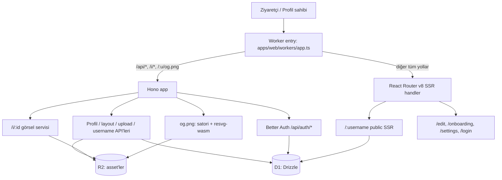
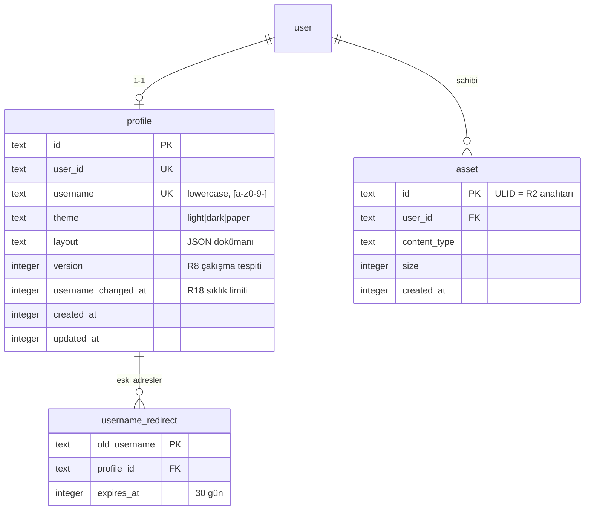
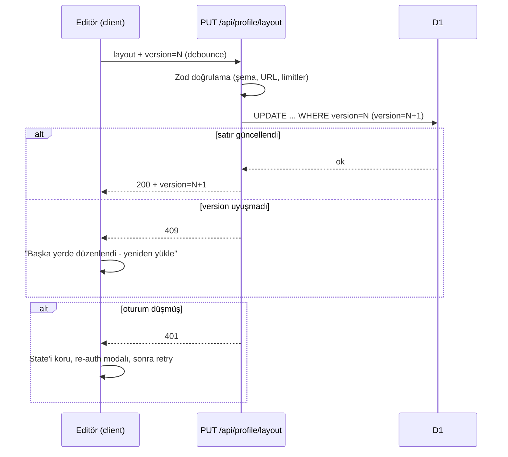

# Caka MVP - Plan

## Goal Capsule

- **Objective:** Boş repodan `caka.app` MVP'sini yayına almak: Google girişli, bento-grid editörlü, SSR public profil sayfalı link-in-bio ürünü. Hedef ölçek 300–500 kullanıcı.
- **Authority:** Ürün davranışında R-ID'ler, teknik mekanizmada KTD-ID'ler bağlayıcıdır. Bir unit hiçbirini geçersiz kılamaz.
- **Execution profile:** Unit'ler bağımlılık sırasıyla ilerler. U6 içindeki react-grid-layout spike'ı, editör mimarisine bağlanmadan önce tamamlanır (KTD8).
- **Stop conditions:** (1) Spike sonucu react-grid-layout ve gridstack'in ikisi de elenirse dur ve kullanıcıya sor. (2) Better Auth'un Workers üzerinde Google akışı pinlenen sürümde çalışmazsa sürüm değiştirerek en fazla iki deneme yap, sonra dur. (3) Ürün kapsamını değiştirecek her karar kullanıcıya döner.
- **Tail ownership:** Deploy hattı U12'de kurulur; canlıya alma (DNS/custom domain) kullanıcı onayı ister.

---

## Product Contract

### Summary

Bu plan, Caka MVP'sinin tamamını uçtan uca kurar: pnpm monorepo iskeleti, Google girişli onboarding ve adres seçimi, 5 blok tipli sürükle-bırak grid editör, üç temalı ve SEO + dinamik og:image'li SSR public sayfa, hesap ayarları ve Cloudflare deploy hattı. Ölçekleme altyapısı (cache katmanı dahil) bilinçli olarak kapsam dışıdır; paket sınırları ve blok sistemi sonradan genişlemeye uygun kurulur.

### Problem Frame

Instagram/TikTok bio'suna koyulan tek link, klasik alt alta link listesi yerine kullanıcının kendi mini sitesi gibi davranan bir sayfa açmalı. Kullanıcı kod yazmadan, dakikalar içinde, sürükle-bırakla gerçek bir "sayfa" kurup paylaşabilmeli. MVP'nin tek akışı: profilini kur, yayınla, paylaş.

### Actors

- A1. **Profil sahibi** — Google ile giriş yapar, sayfasını düzenler.
- A2. **Ziyaretçi** — `caka.app/kullaniciadi`'yi açar; hesabı yoktur, sayfayı okur ve linklere tıklar.

### Requirements

**Auth ve onboarding**

- R1. Kayıt/giriş yalnızca Google OAuth ile olur; şifre akışı yoktur.
- R2. Kullanıcı benzersiz bir adres (username) seçer. Kurallar: `[a-z0-9-]`, 3–30 karakter, başta/sonda tire yok; girdi otomatik küçük harfe çevrilir; rezerve isim listesi (tüm uygulama route'ları + kötüye kullanım terimleri) engellenir. Benzersizlik DB unique index ile garanti edilir; yarışı kaybeden istek 409 alır ve onboarding satır içi hata gösterir.
- R3. Adres alındığı anda public sayfa yayındadır ve asla boş görünmez: layout, Google hesabından gelen isim ve avatarla (avatar R2'ye kopyalanır) önceden doldurulmuş bir profil kartıyla tohumlanır.
- R4. Hesabı olup profili olmayan kullanıcı, korumalı her route'tan `/onboarding`'e yönlenir.
- R5. Google OAuth iptal/reddi kullanıcıyı `/login`'e hata mesajı ve yeniden deneme seçeneğiyle döndürür.

**Editör**

- R6. Kullanıcı blok ekler, siler, sürükleyip taşır ve boyutlandırır. Her blok tipinin min/maks boyutları ve metin alanı uzunluk limitleri paylaşılan şemada tanımlıdır ve hem editörde hem sunucuda uygulanır (durum metni ≤140, başlıklar ≤60 karakter).
- R7. İki breakpoint vardır: desktop 4 kolon, mobil 2 kolon. Editörde desktop/mobil önizleme anahtarı bulunur. Mobil yerleşim, kullanıcı mobil görünümde elle değişiklik yapana kadar desktop'tan otomatik türetilir (genişlik 2'ye kırpılır, okuma sırasına göre dizilir); ilk elle değişiklikten sonra mobil yerleşim kullanıcıya aittir.
- R8. Kaydet = yayın: debounce'lu autosave tam layout dokümanını gönderir; taslak durumu yoktur. Eşzamanlı yazma (iki sekme/cihaz) sürüm kontrolüyle yakalanır: bayat sürümle gelen kayıt 409 alır ve editör "başka yerde düzenlendi — yeniden yükle" uyarısı gösterir; sessiz üzerine yazma olmaz.
- R9. Oturum düşmesi (autosave 401) edit state'ini kaybettirmez: editör bellekteki durumu korur, yeniden giriş modalı gösterir ve bekleyen kaydı tekrar dener. Retry yalnızca yeniden giriş yapan kullanıcı 401 öncesindeki kullanıcıyla aynıysa atılır; farklı hesapla girişte bekleyen kayıt çöpe gider ve editör yeniden yüklenir (hesaplar arası yazma engeli).
- R10. Beş blok tipi: profil kartı (isim, unvan, avatar), link kartı (başlık + URL), görsel kartı, sosyal hesap kartı, durum/duyuru kartı (kısa metin + opsiyonel link).
- R11. Sosyal hesap kartı handle tabanlıdır: platform enum'u (Instagram, TikTok, X, YouTube, LinkedIn, GitHub, WhatsApp, Telegram, Spotify) + kullanıcı adı; hedef URL sunucuda şablondan üretilir, serbest URL kabul edilmez.
- R12. Üç tema: `light` (varsayılan), `dark`, `paper`. Tek tıkla değişir; yerleşim sabit kalır, yalnızca renk/tipografi değişir.

**Public sayfa**

- R13. `caka.app/:username` SSR ile döner; ziyaretçiye editör JS'i yüklenmez; mobil ve masaüstünde düzgün görünür.
- R14. Sayfa SEO meta (title, description, canonical, og/twitter etiketleri) ve profil başına dinamik og:image taşır. Kaynak: layout'taki ilk profil kartı; yoksa Google hesap adı; o da yoksa `@username`. Avatarsız og:image, tema zemini üzerine baş harflerle üretilir. Meta/title değerleri yalnızca React Router meta API'siyle üretilir; public SSR'da string ile kurulan `<head>` veya `dangerouslySetInnerHTML` kullanılmaz (kullanıcı adı/unvanı saldırgan kontrollü metindir).
- R15. Bilinmeyen username 404 sayfası döner ve "bu adres boşta, kap!" kayıt CTA'sı gösterir. Lookup büyük/küçük harf duyarsızdır (`/John` → `john`); geçersiz karakter içeren yol hızlı 404 alır.

**Görseller**

- R16. Görsel yükleme: JPEG/PNG, en fazla 5 MB; tip ve boyut istemcide ön-kontrol edilir, sunucuda doğrulanır. Sunucu doğrulama sırası: `Content-Length` gövde okunmadan reddedilir; gövde 5 MB tavanlı biçimde okunur (yalancı/eksik Content-Length tavanı aşamaz); saklanan content-type istemci beyanından değil magic byte'lardan türetilir, uyuşmazlık 400 alır. Kullanıcı başına kota: en fazla 50 asset ve toplam 100 MB (`asset` tablosundan yükleme anında uygulanır). Görsel bloğu layout'a ancak yükleme başarıyla `assetId` döndürdükten sonra eklenir; başarısız yüklemede yer tutucu blok kaldırılır.
- R17. Asset yaşam döngüsü: kayıt sırasında silme/diff yapılmaz; R2 temizliği yalnızca hesap silmede çalışır. Ölü `assetId` içeren görsel bloğu editörde nötr yer tutucuyla gösterilir, public sayfada hiç render edilmez.

**Ayarlar**

- R18. Adres değişikliği: aynı kurallar ve benzersizlik kontrolüyle; sıklık limiti 7 günde 1. Eski adres 30 gün boyunca yeni adrese **302** ile yönlendirir (yanıt `Cache-Control: max-age=3600` üstü olmayan kısa cache taşır — 301 tarayıcılarda süresiz cache'lenir ve ad serbest kaldıktan sonra eski sahibin trafiği gasp etmesine yol açar) ve bu süre içinde başkası tarafından alınamaz; süre sonunda serbest kalır.
- R19. Hesap silme: kullanıcı username'ini yazarak onaylar; asset kayıtlarındaki anahtarlarla R2 nesneleri, ardından D1 satırları (profil, asset, redirect, auth tabloları) silinir ve oturumlar kapatılır. R2 silmeleri kısmen başarısız olursa D1 silme yine tamamlanır; artık nesneler bu ölçekte tolere edilir.

**Güvenlik**

- R20. Kullanıcı kaynaklı tüm URL'ler (link/durum blokları) yalnızca `http(s)` şemasıyla kabul edilir; şemasız girdiye `https://` eklenir; doğrulama layout kaydında sunucu tarafında zorunludur.
- R21. Güvenlik başlıkları **tüm** SSR ve API yanıtlarına middleware'den uygulanır (yalnızca public sayfalara değil): CSP (`default-src`, `script-src` sayfanın gerçek JS ayak izine göre en kısıtlı hali, `object-src 'none'`, `base-uri 'self'`, `form-action 'self'`, `frame-ancestors 'none'`), `X-Frame-Options: DENY`, HSTS, `X-Content-Type-Options: nosniff`, `Referrer-Policy`, `Permissions-Policy`.
- R22. Mutasyon yapan her `/api/*` endpoint'i `Origin` başlığını uygulama origin'ine karşı doğrular (SameSite cookie'nin üzerine savunma katmanı) ve hiçbir GET endpoint'i state değiştirmez. Auth dışı hassas endpoint'ler hafif hız limiti taşır: `username-check` oturum ister ve kullanıcı başına throttle edilir; og.png üretimi cache + hız limitiyle korunur (KTD6/KTD7).

### Key Flows

- F1. **Yeni kullanıcı** — Landing → `/login` → Google OAuth → profil yok → `/onboarding` (adres seç, R2) → sayfa tohumlanır (R3) → `/edit`'e düşer → blok ekler, autosave yayınlar (R8) → linki paylaşır. Covers R1–R4, R6–R8.
- F2. **Ziyaretçi** — `/:username` → SSR sayfa (R13–R14) → linklere tıklar; bilinmeyen adreste 404 CTA (R15). Covers R13–R15, R20–R21.
- F3. **Adres değişikliği** — `/settings` → yeni adres → eski adres 30 gün 302 (R18). Covers R18.
- F4. **Hesap silme** — `/settings` → username yazarak onay → R2 + D1 temizliği → çıkış (R19). Covers R19.
- F5. **Oturum düşmesi** — autosave 401 → re-auth modalı → bekleyen kayıt tekrar denenir (R9). Covers R9.

### Acceptance Examples

- AE1. **Covers R2.** Given `deniz` adresi boş görünüyor iki sekmede, When ikisi de aynı anda claim eder, Then biri başarılı olur, diğeri 409 alır ve onboarding'de satır içi hata görür.
- AE2. **Covers R8.** Given aynı profil iki sekmede açık, When A sekmesi kaydettikten sonra B sekmesi bayat sürümle autosave atar, Then B 409 alır ve "yeniden yükle" uyarısı görür; A'nın kaydı bozulmaz.
- AE3. **Covers R17.** Given bir görsel bloğunun asset'i R2'de yoksa, When public sayfa render edilir, Then blok hiç görünmez ve sayfa hatasız döner.
- AE4. **Covers R18.** Given `ali` adresi `veli`'ye taşındı, When ziyaretçi 30 gün içinde `/ali`'yi açar, Then `/veli`'ye 302 ile ve kısa cache başlığıyla yönlenir; 30 gün sonra `/ali` 404 CTA döner ve yeniden alınabilir.
- AE5. **Covers R5.** Given kullanıcı Google onay ekranında "iptal" der, When callback'e dönülür, Then `/login` hata mesajı ve tekrar dene butonuyla açılır; boş/ölü sayfa oluşmaz.
- AE6. **Covers R20.** Given link bloğuna `javascript:alert(1)` girildi, When layout kaydedilir, Then sunucu isteği doğrulama hatasıyla reddeder ve public sayfaya asla yansımaz.

### Scope Boundaries

**MVP dışı (sonraya ertelendi):** ödeme/fiyatlandırma, tıklama analitiği, çoklu sayfa ve çoklu dil, ekip hesapları, e-posta toplama, satış/ürün blokları, özel alan adı, gelişmiş widget'lar, taslak/yayın ayrımı, WebP yükleme ve görsel yeniden boyutlandırma, edge cache katmanı (KTD6), Turborepo (KTD11), dokunmatik için özel editör UX'i (mobilde düzenleme çalışır ama best-effort).

---

## Planning Contract

### Key Technical Decisions

- KTD1. **Tamamen Cloudflare: Workers + D1 + R2.** (session-settled: user-directed — Vercel + Supabase/Neon kombinasyonları yerine: kullanıcı tüm altyapının Cloudflare üzerinde olmasını seçti.)
- KTD2. **Tek Worker: Hono + React Router v8 SSR, elle dispatch.** Hono ve SSR kararı kullanıcıya ait (session-settled: user-directed — SPA yerine SSR, ayrı backend framework'ü yerine Hono). Worker entry'si `apps/web/workers/app.ts` isteği ayırır: `/api/*`, `/i/*` ve `/:username/og.png` Hono'ya, kalan her şey React Router request handler'ına gider. React Router **v8** hedeflenir (Haziran 2026'da çıktı; v7'nin düşük riskli devamı, `react-router-dom` paketi kalktı, resmi Cloudflare Vite plugin şablonu var) — v7 ile başlayıp yakın vadede migration yemek anlamsız. Adapter kütüphanesi kullanılmaz: `hono-react-router-adapter` kendini "unstable" ilan ediyor; `react-router-hono-server` olgun alternatif ama elle dispatch bağımlılıksız ve yeterli.
- KTD3. **Drizzle ORM stable'a pinli (drizzle-orm 0.44.x, drizzle-kit 0.31.x), düz `.sql` migration + `wrangler d1 migrations apply`.** Drizzle v1 RC'nin klasörlü migration çıktısını wrangler okumuyor — RC'ye geçilmez; `latest` yerine sabit sürüm yazılır.
- KTD4. **Better Auth ≥1.6 pinli, yalnızca Google.** (session-settled: user-directed — Supabase Auth/Auth.js yerine.) Drizzle adapter `provider: "sqlite"` ile D1 üzerinde. `compatibility_date ≥ 2026-08-04` (nodejs_compat varsayılan oluyor). `cookieCache` + secondary storage kombinasyonu bilinen bug nedeniyle kullanılmaz; IP tespiti `cf-connecting-ip` başlığından; Better Auth'un yerleşik origin/CSRF koruması ve rate limiter'ı açık kalır. Sürüm yükseltmelerinde Google akışı smoke-test edilir (haftalık release + Workers'a özgü regresyon geçmişi var). Kimlik, Google `sub` (provider accountId) üzerinden eşlenir — asla e-posta üzerinden değil; e-posta tabanlı otomatik account linking kapalı tutulur (e-posta geri dönüşümüyle hesap devri sınıfını kapatır). Google hesabı silinen kullanıcı için MVP'de kurtarma yolu yoktur; bu bilinçli bir kabuldür.
- KTD5. **Layout, profil satırında tek JSON dokümanı + integer `version` kolonu.** (session-settled: user-approved — normalize blok tablosu yerine: editör tam dokümanı tek istekte kaydeder, satır bazlı senkron derdi olmaz.) Version, R8'deki 409 tespitini sağlar; şema `packages/shared`'da Zod ile tanımlı, editör/sunucu/SSR aynı tipi kullanır.
- KTD6. **MVP'de edge cache katmanı yok; public sayfa her istekte D1'den okur.** 300–500 kullanıcıda D1 ücretsiz tier (5M okuma/gün) fazlasıyla yeter; Workers Cache API'nin `cache.delete()`'i yalnızca yerel colo'yu temizlediği için "kaydet = anında yayında" gereksinimiyle zaten uyumsuz. İleride gerekirse doğru araç `ctx.cache.purge()` (2026 global purge API'si) — plana girmez. **Tek kapsamlı istisna — og.png:** satori üretimi CPU-yoğun olduğundan `/:username/og.png` yanıtı Cache API'de query string'i atılmış kanonik URL anahtarıyla 1 saat saklanır (cache-busting'i etkisizleştirir); browser'a giden `max-age` başlığı Cloudflare CDN'inde cache oluşturmaz, o yüzden Worker içi Cache API şarttır (R22'nin og.png koruması).
- KTD7. **og:image: doğrudan satori + resvg-wasm, PNG çıktı.** `workers-og` ~9 aydır yayınlanmıyor, üzerine kurulmaz. Bilinen Workers kısıtları tasarıma girer: WASM statik import edilir; avatar R2 binding'den okunup base64 data-URL yapılır (dışa `fetch` yok — SSRF yüzeyi tamamen kapanır); satori yalnızca PNG/JPEG kaynak kabul eder; çok çocuklu her kapsayıcıda `display:flex` zorunlu.
- KTD8. **Grid editör: react-grid-layout v2 — önce spike.** v2.2.4'ün React 19 uyumu maintainer'larca açıkça beyan edilmemiş (gevşek peer range); editör mimarisi bağlanmadan U6 içinde küçük bir sürükle+boyutlandır+2-breakpoint spike'ı yapılır. Başarısızsa Plan B: gridstack.js v13 (aktif bakımlı; React sarmalayıcısı paket değil, örnek kod).
- KTD9. **Username şeması: tek lowercase kolon; rename'de redirect tablosu.** Girdi normalize edilip tek kolonda unique tutulur (`COLLATE NOCASE` yerine — ASCII-only ve index sürprizleri var; bu karar ilk migration'da verilmek zorunda). Rezerve liste `packages/shared`'da tek kaynak ve tüm route adlarını (`edit`, `onboarding`, `login`, `settings`, `api`, `i`, `og`, `assets` …) + kötüye kullanım terimlerini içerir. Rename R18'in redirect/grace davranışını `username_redirect` tablosuyla taşır.
- KTD10. **R2: Worker üzerinden upload; asset anahtarı düz ULID.** 5 MB tavan, Workers'ın 100 MB gövde limitinin çok altında — presigned URL altyapısına gerek yok (lokal dev'de de çalışmıyor). Gövde R16'nın doğrulama sırasıyla okunur (Content-Length ön-reddi + 5 MB tavanlı okuma; R2 streaming'de bilinen uzunluk istediği için sonuç bellekte tutulup yazılır — tavan sayesinde OOM riski yok). R2 anahtarı = asset ULID'i (düz, path segmentsiz) → `/i/:id` route'unda path-traversal yüzeyi kalmaz; yanıt `Cache-Control: public, max-age=31536000, immutable`, `X-Content-Type-Options: nosniff`, `Content-Disposition: inline` ve kısıtlayıcı yanıt-CSP'si (`default-src 'none'; sandbox`) taşır.
- KTD11. **pnpm workspaces, Turborepo'suz; `wrangler.jsonc` `apps/web` içinde.** (session-settled: user-directed — monorepo + pnpm kullanıcı tercihi.) Tek deploy hedefi varken Turborepo config yükünden ibaret; ikinci deploy hedefi çıktığında yeniden değerlendirilir.
- KTD12. **Temalar CSS custom property token'ları; `<html data-theme>` ile uygulanır.** shadcn token'ları (`--background`, `--card`, …) üç temaya map edilir; blok bileşenleri yalnızca token tüketir, böylece R12'nin "yerleşim sabit, renk değişir" kuralı yapısal olarak garanti olur.
- KTD13. **Editör önizlemesi ve public sayfa aynı render bileşenlerini kullanır.** Blok render'ları `packages/ui`'da yaşar; editör bunları grid içinde, SSR statik CSS grid içinde çağırır. "Gördüğün = yayınlanan" başka bir mekanizma gerektirmez.

### High-Level Technical Design

**İstek akışı ve bileşen topolojisi:**



**Veri modeli** (Better Auth'un kendi tabloları — `user`, `session`, `account`, `verification` — hariç):



**Autosave ve çakışma akışı (R8, R9):**



**Layout JSON şekli** (yönlendirici taslak — kesin şema U3'te Zod ile yazılır):

```jsonc
{
  "version": 1,                    // şema versiyonu (DB'deki version kolonundan ayrı)
  "blocks": [{
    "id": "blk_x1",
    "type": "profile | link | image | social | status",
    "pos": { "lg": {"x":0,"y":0,"w":2,"h":2}, "sm": {"x":0,"y":0,"w":2,"h":2} },
    "smManual": false,             // R7: mobil yerleşim elle düzenlendi mi
    "data": { }                    // tipe özel alanlar, tip başına Zod şeması
  }]
}
```

### Output Structure

```text
caka.app/
├─ apps/
│  └─ web/
│     ├─ app/                    # RR v8 route'ları: landing, login, onboarding, edit, settings, $username
│     ├─ server/                 # Hono app: auth mount, api/, images, og
│     ├─ workers/app.ts          # Worker entry: Hono ↔ RR dispatch (KTD2)
│     ├─ react-router.config.ts  # ssr: true
│     ├─ vite.config.ts          # @cloudflare/vite-plugin
│     ├─ wrangler.jsonc          # D1 + R2 binding'leri, compatibility_date ≥ 2026-08-04
│     └─ drizzle.config.ts
├─ packages/
│  ├─ shared/                    # Zod şemaları (layout, bloklar, username), rezerve liste, sabitler
│  ├─ ui/                        # blok render bileşenleri, tema token'ları, shadcn bileşenleri
│  └─ db/                        # Drizzle şeması + migrations/
├─ pnpm-workspace.yaml
└─ docs/
```

Ağaç kapsam beyanıdır; implementasyon daha iyi bir yerleşim bulursa unit'lerin `Files` listeleri esas alınarak güncellenebilir.

---

## Implementation Units

| U-ID | Başlık | Ana dosyalar | Bağımlılık |
|---|---|---|---|
| U1 | Monorepo + Worker iskeleti | `pnpm-workspace.yaml`, `apps/web/*`, `workers/app.ts` | — |
| U2 | DB şeması + migration hattı | `packages/db/*` | U1 |
| U3 | Paylaşılan blok/layout şemaları | `packages/shared/*` | U1 |
| U4 | Better Auth + Google girişi | `apps/web/server/auth.ts`, `app/routes/login*` | U2 |
| U5 | Onboarding + adres seçimi | `app/routes/onboarding*`, `server/api/username.ts` | U3, U4 |
| U6 | Grid editör (spike + kabuk) | `app/routes/edit*`, `packages/ui/*` | U3, U5 |
| U7 | Layout kayıt API + autosave | `server/api/layout.ts` | U6 |
| U8 | Görsel yükleme + servis | `server/api/upload.ts`, `server/images.ts` | U4, U2 |
| U9 | Public profil SSR + temalar | `app/routes/$username.tsx`, `packages/ui/*` | U2, U3, U6 |
| U10 | Dinamik og:image | `server/og.tsx` | U9 |
| U11 | Ayarlar: adres değiştirme + hesap silme | `app/routes/settings*`, `server/api/account.ts` | U5, U8 |
| U12 | Deploy hattı + üretim sertleştirme | `.github/workflows/deploy.yml`, `wrangler.jsonc` | tümü |

### U1. Monorepo ve Worker iskeleti

- **Goal:** Çalışan, deploy edilebilir boş uygulama: pnpm workspaces + RR v8 Cloudflare şablonu + Hono dispatch + Tailwind v4 + shadcn.
- **Requirements:** KTD1, KTD2, KTD11 altyapısı; R13'ün SSR zemini.
- **Files:** `pnpm-workspace.yaml`, `apps/web/` (create-react-router Cloudflare şablonundan), `apps/web/workers/app.ts`, `apps/web/wrangler.jsonc`, `packages/shared/package.json`, `packages/ui/package.json`, `packages/db/package.json`, kök `tsconfig`/eslint/prettier.
- **Approach:**
  1. `create-react-router` Cloudflare şablonuyla `apps/web` oluştur (`ssr: true`, `@cloudflare/vite-plugin`).
  2. `workers/app.ts`'te KTD2'deki elle dispatch'i kur; Hono'ya şimdilik `/api/health` koy.
  3. Boş `packages/*` paketlerini `workspace:*` bağımlılıklarıyla bağla.
  4. Tailwind v4 + `shadcn init` (resmi React Router yolu); `wrangler.jsonc`'ye `compatibility_date ≥ 2026-08-04` ve boş D1/R2 binding blokları.
- **Patterns to follow:** Cloudflare'in resmi React Router framework guide'ı; shadcn'in react-router kurulum dokümanı.
- **Test scenarios:**
  - `wrangler dev` altında `/` SSR render döner, `/api/health` Hono'dan 200 döner.
  - `pnpm typecheck` ve `pnpm build` workspace genelinde temiz geçer.
  - Test expectation: bunun ötesinde unit test yok — saf iskelet.
- **Execution note:** Paketleme/config ağırlıklı; unit coverage yerine `wrangler dev` smoke doğrulaması esastır.
- **Verification:** Lokal dev'de SSR sayfası ve Hono endpoint'i aynı Worker'dan servis ediliyor; `wrangler deploy` (workers.dev) başarılı.

### U2. DB şeması ve migration hattı

- **Goal:** Drizzle şeması (KTD9'daki `profile`, `asset`, `username_redirect` + Better Auth tabloları) ve tekrarlanabilir migration akışı.
- **Requirements:** R2, R8 (`version` kolonu), R17, R18; KTD3, KTD9.
- **Files:** `packages/db/src/schema.ts`, `packages/db/migrations/`, `apps/web/drizzle.config.ts`, `apps/web/wrangler.jsonc` (D1 binding).
- **Approach:** HTD'deki ER modelini Drizzle'a çevir; `username` unique + lowercase check; sürümler package.json'da sabit (KTD3 — `latest` yasak). Migration akışı: `drizzle-kit generate` → `wrangler d1 migrations apply --local` (dev) / `--remote` (CI, U12).
- **Patterns to follow:** Drizzle'ın resmi D1 get-started akışı; Better Auth CLI'ının şema üretimi (`@better-auth/cli generate`) auth tabloları için.
- **Test scenarios:**
  - Migration'lar boş lokal D1'e sıfırdan uygulanır ve idempotent biçimde tekrar koşulabilir.
  - `username` unique ihlali beklenen constraint hatasını üretir (AE1'in DB katmanı).
  - `version` kolonu koşullu UPDATE ile artar; bayat versiyonla UPDATE 0 satır etkiler.
- **Verification:** Lokal D1'de tüm tablolar oluşur; drizzle client ile örnek CRUD çalışır.

### U3. Paylaşılan blok ve layout şemaları

- **Goal:** `packages/shared`'da tek kaynak: layout dokümanı, 5 blok tipinin Zod şemaları, boyut/uzunluk limitleri, URL doğrulama, rezerve isim listesi, sosyal platform enum + URL şablonları.
- **Requirements:** R6, R7 (`smManual`), R10, R11, R20; R2'nin username kuralları; KTD5, KTD9.
- **Files:** `packages/shared/src/layout.ts`, `packages/shared/src/blocks/*.ts`, `packages/shared/src/username.ts`, `packages/shared/src/social.ts`, testler `packages/shared/src/*.test.ts`.
- **Approach:** HTD'deki layout taslağını kesin şemaya çevir. Blok tipi başına `data` şeması + min/maks `w/h` sabiti. URL alanları tek ortak `safeUrl` şemasından geçer (R20: http/https, şemasıza https:// öneki). Username: normalize + regex + rezerve liste kontrolü tek fonksiyonda.
- **Test scenarios:**
  - Her blok tipi için geçerli/geçersiz `data` örnekleri (eksik alan, limit aşımı: 141 karakter durum metni reddedilir).
  - `javascript:`, `data:`, protokolsüz ve büyük harfli URL girdileri: ilk ikisi reddedilir, son ikisi normalize edilir (AE6'nın şema katmanı).
  - Username: `Edit`, `ONBOARDING` rezerve listeye takılır; `ali-`, `-ali`, `al`, 31 karakter reddedilir; `John` → `john` normalize olur.
  - Sosyal enum: her platform için handle → URL şablonu doğru üretilir; enum dışı platform reddedilir.
  - Grid sınırları: `lg` 4 kolonu, `sm` 2 kolonu aşan pozisyonlar reddedilir.
- **Execution note:** Bu paket saf fonksiyon — test-first yazmaya en uygun unit; şemaları testleriyle birlikte geliştir.
- **Verification:** `pnpm -F shared test` yeşil; editör/sunucu bu paketten import edebiliyor.

### U4. Better Auth + Google girişi

- **Goal:** Google-only auth uçtan uca: login sayfası, OAuth redirect akışı, session middleware, korumalı route guard'ı.
- **Requirements:** R1, R4, R5; KTD4.
- **Files:** `apps/web/server/auth.ts`, `apps/web/server/middleware/session.ts`, `apps/web/app/routes/login.tsx`, `apps/web/app/routes/_index.tsx` (landing CTA), `.dev.vars.example`.
- **Approach:** Better Auth'u Drizzle adapter (`provider: "sqlite"`) ile kur, Hono'ya `/api/auth/*` mount et. KTD4'ün sertleştirme maddeleri burada uygulanır (`trustedOrigins`, `cf-connecting-ip`, cookieCache kapalı). RR loader'ları için `getSession` yardımcıları; profili olmayan oturum `/onboarding`'e, oturumsuz istek `/login`'e yönlenir (R4). Google `error`/iptal callback'i `/login?error=...`'a düşer (R5).
- **Patterns to follow:** Better Auth resmi Google provider dokümanı; `better-auth-cloudflare` (zpg6) reposu D1 wiring referansı olarak (bağımlılık olarak değil).
- **Test scenarios:**
  - Oturumsuz `/edit` isteği `/login`'e, profilsiz oturumla `/edit` isteği `/onboarding`'e yönlenir (redirect zinciri testi).
  - OAuth iptali `/login`'de hata mesajı gösterir, 500/boş sayfa üretmez (AE5).
  - Session cookie `httpOnly` + `Secure` + `SameSite=Lax` ile set edilir.
  - Mevcut bir kullanıcının e-postasını taşıyan ama farklı Google `sub`'lı giriş, mevcut hesaba bağlanmaz — ayrı kullanıcı oluşur veya reddedilir (KTD4).
  - Entegrasyon (manuel smoke): gerçek Google hesabıyla giriş → session → çıkış.
- **Verification:** Lokal dev'de tam Google akışı çalışır; pinlenen Better Auth sürümü kayıtlı.

### U5. Onboarding ve adres seçimi

- **Goal:** Adres seçme ekranı: canlı uygunluk kontrolü, yarış-güvenli claim, sayfanın tohumlanması.
- **Requirements:** R2, R3, R4; KTD9.
- **Files:** `apps/web/app/routes/onboarding.tsx`, `apps/web/server/api/username.ts`, `apps/web/server/api/profile.ts`; testler: `apps/web/server/api/username.test.ts`, `apps/web/server/api/profile.test.ts`.
- **Approach:**
  1. `GET /api/username-check` yalnızca tavsiye niteliğinde (R2); oturum ister ve kullanıcı başına throttle edilir (R22); asıl garanti claim'deki unique index.
  2. Claim: profil satırı + tohum layout tek akışta yazılır; unique ihlali 409'a çevrilir.
  3. Tohumlama (R3): Google `name`/`picture` ile profil kartı; avatar Worker içinde fetch edilip R2'ye kopyalanır ve normal asset olur (Google URL'i hotlink edilmez). Bu fetch yalnızca allowlist'lenmiş Google görsel host'larına gider, boyut tavanı ve timeout taşır ve indirilen içerik `/api/upload` ile aynı doğrulamadan (magic byte, tip, boyut — R16) geçer. Tohum layout U3 Zod şemasından geçirilerek yazılır (isim limitlere kırpılır); geçersiz tohum verisi varsayılanlara düşer, şemayı asla atlamaz. Avatar kopyalama başarısız olursa claim yine tamamlanır, kart avatarsız tohumlanır.
- **Test scenarios:**
  - Aynı username'e eşzamanlı iki claim: biri 200, biri 409 (AE1) — testte unique ihlali simüle edilir.
  - Rezerve isim claim denemesi 400 döner (route'lar üzerinden, U3 şemasıyla).
  - Claim sonrası profil satırında tohum profil kartı vardır ve `version=1`'dir.
  - Avatar kopyalama hatasında claim başarılı, layout avatarsız profil kartı içerir.
  - Google adı 60 karakteri aşan veya `</title><script>` içeren kullanıcıda tohum profil kartı kırpılmış/düz metin olarak şemadan geçer.
  - Oturumsuz `username-check` isteği 401 alır.
  - Profili olan kullanıcı `/onboarding`'e girerse `/edit`'e yönlenir.
- **Verification:** Yeni hesapla uçtan uca: giriş → adres seç → `/edit`'e düş → `caka.app/adres` dolu sayfa döner.

### U6. Grid editör: spike + kabuk

- **Goal:** Önce KTD8 spike'ı, sonra editör: blok ekleme/silme/sürükleme/boyutlandırma, iki breakpoint önizlemesi, blok düzenleme formları, tema seçici.
- **Requirements:** R6, R7, R10, R11 (form tarafı), R12 (seçici); KTD8, KTD12, KTD13.
- **Files:** `apps/web/app/routes/edit.tsx`, `apps/web/app/components/editor/*`, `packages/ui/src/blocks/*` (render bileşenleri), `packages/ui/src/themes.css`.
- **Approach:**
  1. **Spike (önce):** react-grid-layout v2 + React 19 ile sürükle+boyutlandır+2-breakpoint minimal deneme. Başarısızsa gridstack.js'e geç (KTD8) ve bu unit'in kalanını ona göre uygula.
  2. Editör state'i client'ta `layout` dokümanı olarak tutulur; RGL olayları `pos.lg`/`pos.sm`'e çevrilir; R7'nin auto-türetme kuralı (`smManual` bayrağı) burada uygulanır.
  3. Blok formları U3 şemalarıyla doğrular; tipe özel min/maks RGL constraint'lerine map edilir.
  4. Tema seçici `data-theme`'i canlı değiştirir (KTD12); render bileşenleri `packages/ui`'dan gelir (KTD13).
- **Test scenarios:**
  - Blok ekleme varsayılan pozisyon/boyutla dokümana eklenir; silme kaldırır.
  - Desktop'ta taşınan blok, `smManual=false` iken mobil yerleşimi yeniden türetir; mobil görünümde elle taşınan blok `smManual=true` olur ve sonraki desktop değişiklikleri onu ezmez.
  - 4x4 profil kartı 2 kolonlu mobilde 2 genişliğe kırpılır.
  - Form doğrulama hataları (uzun başlık, geçersiz URL) satır içi gösterilir, dokümana yazılmaz.
- **Execution note:** Spike bu unit'in ilk adımı ve çıktısı yazılı bir karar (RGL kaldı / gridstack'e geçildi); editör kodu spike sonucundan önce yazılmaz.
- **Verification:** Editörde beş blok tipiyle serbest düzenleme; iki breakpoint önizlemesi tutarlı; konsol hatasız.

### U7. Layout kayıt API'si ve autosave

- **Goal:** `PUT /api/profile/layout`: tam doküman doğrulama, versiyon kontrolü, debounce'lu autosave ve hata UX'i.
- **Requirements:** R8, R9, R20 (sunucu tarafı zorunluluğu); KTD5.
- **Files:** `apps/web/server/api/layout.ts`, `apps/web/app/components/editor/autosave.ts`; testler: `apps/web/server/api/layout.test.ts`.
- **Approach:** İstek gövdesi U3 şemasından geçer (URL/limit ihlalleri 400). Yazma, HTD'deki koşullu UPDATE ile (`WHERE version = :n`); 0 satır → 409. Client: ~1 sn debounce, uçuşta tek istek, 409'da R8 uyarısı, 401'de R9 akışı (state korunur, re-auth, retry), ağ hatasında sessiz retry + kalıcı hata göstergesi. Tema değişikliği de aynı endpoint'ten (`theme` alanı) geçer.
- **Test scenarios:**
  - Geçerli doküman 200 + artan version döner.
  - Bayat version 409 döner ve DB'yi değiştirmez (AE2).
  - `javascript:` URL'li doküman 400 alır (AE6'nın API katmanı).
  - Başkasının profiline PUT 403/404 alır (sahiplik kontrolü).
  - 401 sonrası yeniden girişte oturum farklı bir kullanıcıya aitse bekleyen kayıt gönderilmez, editör yeniden yüklenir (R9).
  - 4 kolon dışına taşan pozisyon 400 alır.
- **Verification:** Editörde yapılan değişiklik ~1-2 sn içinde D1'e yazılır; iki sekme senaryosu elle doğrulanır.

### U8. Görsel yükleme ve servis

- **Goal:** `POST /api/upload` (buffered, ≤5 MB, JPEG/PNG) ve `/i/:id` R2 servisi.
- **Requirements:** R16, R17 (servis tarafı: ölü asset davranışının altyapısı); KTD10.
- **Files:** `apps/web/server/api/upload.ts`, `apps/web/server/images.ts`, `apps/web/app/components/editor/image-upload.ts`; testler: `apps/web/server/api/upload.test.ts`, `apps/web/server/images.test.ts`.
- **Approach:** Upload: auth zorunlu; R16'nın doğrulama sırası uygulanır (Content-Length ön-reddi → 5 MB tavanlı okuma → magic byte'tan content-type türetme → kullanıcı kotası kontrolü); ULID üretilir, R2'ye yazılır, `asset` satırı açılır, `{assetId}` döner. Client: ön-kontrol (tip/boyut), yükleme bitmeden blok dokümana eklenmez (R16). Servis: `/i/:id` — ULID formatı regex'le doğrulanır, R2 `get`, KTD10'daki yanıt başlıkları; bulunamazsa 404.
- **Test scenarios:**
  - 6 MB dosya ve `image/gif` 400 alır (hem client ön-kontrol hem sunucu).
  - 90 MB `Content-Length` beyan eden istek gövde okunmadan reddedilir; Content-Length'siz/yalancı istek 5 MB tavanında kesilir.
  - `image/png` beyan edip HTML içeren dosya magic-byte kontrolünde 400 alır (stored-XSS/hosting vektörü).
  - Kota dolu kullanıcının (50 asset veya 100 MB) sonraki yüklemesi 4xx alır.
  - Başarılı yüklemede R2 nesnesi ve `asset` satırı oluşur; `/i/:id` 200 + sniff'lenmiş content-type + `nosniff` başlığıyla döner.
  - Geçersiz id formatı (`../secret`) R2'ye gitmeden 400/404 alır.
  - Oturumsuz upload 401 alır.
- **Verification:** Editörden görsel bloğu ekle → yükle → public sayfada görünür; başarısız yüklemede yarım blok kalmaz.

### U9. Public profil SSR ve temalar

- **Goal:** `/:username` SSR sayfası: statik CSS grid render, tema uygulaması, SEO meta, 404 CTA, redirect lookup'ı, güvenlik başlıkları.
- **Requirements:** R13, R14 (meta kısmı), R15, R17 (ölü asset: public'te render edilmez), R18 (302 tarafı), R21; KTD6, KTD12, KTD13.
- **Files:** `apps/web/app/routes/$username.tsx`, `apps/web/app/routes/404-claim.tsx` (veya CatchBoundary), `packages/ui/src/blocks/*`, `apps/web/server/headers.ts`; testler: `apps/web/app/routes/$username.test.ts` (loader/redirect/meta senaryoları).
- **Approach:** Loader: username'i normalize et (R15), `profile` yoksa `username_redirect`'e bak (süresi geçmemişse 302 + kısa cache, R18), o da yoksa 404 CTA. Render: layout JSON → CSS grid (`grid-template-columns`), her blok `packages/ui` bileşeniyle; RGL public'te yüklenmez (R13). `pos.sm`/`pos.lg` media query ile iki yerleşim üretir. Meta: R14'ün kaynak zinciri, yalnızca React Router meta API'siyle (R14). Güvenlik başlıkları R21 kapsamında tüm SSR ve API yanıtlarına tek middleware'den. Route sırası: uygulama route'ları `$username` catch-all'undan önce kaydedilir (rezerve liste + route önceliği birlikte KTD9'u tamamlar).
- **Test scenarios:**
  - Var olan profil 200 + doğru meta etiketleriyle döner; R21 başlıkları (`frame-ancestors` dahil) `/`, `/:username`, `/edit` ve 404 yanıtında mevcut.
  - Profil adı `</title><script>x</script>` olan kullanıcının sayfasında title ve og etiketleri tamamen escape'li render edilir (stored-XSS testi).
  - `/John` → `john` profili döner; `/ali%20veli` 404.
  - Bilinmeyen username 404 + kayıt CTA (R15).
  - Redirect kaydı olan eski adres 302 + kısa cache başlığıyla döner (AE4); süresi geçmişse 404.
  - Ölü assetId'li görsel bloğu HTML'de hiç yer almaz (AE3).
  - Boş grid (tüm bloklar silinmiş): sayfa tema zemininde hatasız döner.
  - Üç temanın her biri `data-theme` ile doğru token setini uygular.
- **Verification:** Lighthouse mobile'da sayfa temel yeterlilikte (SSR, JS'siz içerik); üç tema görsel olarak doğrulanır.

### U10. Dinamik og:image

- **Goal:** `/:username/og.png` — satori + resvg-wasm ile 1200×630 PNG.
- **Requirements:** R14 (og:image kısmı); KTD7.
- **Files:** `apps/web/server/og.tsx`, WASM importları, `apps/web/vite.config.ts` (wasm asset ayarı gerekiyorsa).
- **Approach:** Profil D1'den okunur; avatar `env.BUCKET.get()` ile alınıp base64 data-URL'e çevrilir (dış fetch yok — KTD7); avatarsızsa baş harf dairesi. Şablon satori kısıtlarına göre (her çok çocuklu div `display:flex`). Font dosyası statik asset olarak paketlenir. Üretim KTD6'daki istisna uyarınca Cache API'de saklanır: anahtar query string'i atılmış kanonik URL, TTL 1 saat; browser'a ayrıca `Cache-Control: public, max-age=3600` gider.
- **Test scenarios:**
  - Avatarlı ve avatarsız profil için 200 + `image/png` döner.
  - Bilinmeyen username 404 döner.
  - Aynı URL'e rastgele query parametreleriyle gelen ikinci istek satori'yi tekrar çalıştırmaz, cache'ten döner (cache-busting nötralizasyonu).
  - Uzun isim/unvan taşmadan kırpılır (satori şablonu sınır testi).
- **Execution note:** Satori'nin Workers pitfall'ları (statik WASM importu, flex zorunluluğu) ilk çalışan örnek üzerinde smoke ile doğrulanır; unit test yerine golden-path render testi yeterli.
- **Verification:** Paylaşım önizleme araçlarında (opengraph.xyz vb.) kart doğru görünür.

### U11. Ayarlar: adres değiştirme ve hesap silme

- **Goal:** `/settings`: R18 kurallı adres değişikliği ve R19 kurallı hesap silme.
- **Requirements:** R18, R19; KTD9.
- **Files:** `apps/web/app/routes/settings.tsx`, `apps/web/server/api/account.ts`; testler: `apps/web/server/api/account.test.ts`.
- **Approach:** Adres değişikliği claim ile aynı doğrulama/409 yolunu paylaşır (U5'teki kod yeniden kullanılır); ek olarak: 7 gün sıklık kontrolü (`username_changed_at`), eski adrese `username_redirect` kaydı (30 gün), rezerve/redirect'te tutulan isimler claim'e kapalı. Silme: username yazarak onay; sıra R19'daki gibi — asset anahtarlarıyla R2 silinir, sonra D1 satırları, sonra oturumlar; R2 hataları loglanıp yutulur.
- **Test scenarios:**
  - Başarılı rename: yeni adres çalışır, eski adres 302 + kısa cache başlığıyla döner, redirect kaydının `expires_at`'i ~30 gün sonradır (AE4).
  - 7 gün dolmadan ikinci rename 429/400 alır.
  - Redirect'te tutulan eski adı başka kullanıcı claim edemez (409/400).
  - Yanlış username yazılan silme onayı reddedilir.
  - A kullanıcısının geçerli oturumuyla yapılan rename/silme istekleri B kullanıcısının profilini veya asset'lerini hiçbir koşulda etkileyemez (U7'deki sahiplik testinin aynası).
  - Yanlış/eksik `Origin` başlığıyla gelen mutasyon isteği reddedilir (R22).
  - Silme sonrası: `/:username` 404 CTA, oturum geçersiz, `asset` satırları ve profil yok; R2 silme hatası akışı durdurmaz.
- **Verification:** İki test hesabıyla rename + silme uçtan uca elle doğrulanır.

### U12. Deploy hattı ve üretim sertleştirme

- **Goal:** GitHub Actions ile main'e push'ta migration + deploy; production secrets; custom domain; smoke test.
- **Requirements:** Tüm R'lerin üretimde çalışması; KTD3'ün `--remote` migration adımı.
- **Files:** `.github/workflows/deploy.yml`, `apps/web/wrangler.jsonc` (route/domain), `README.md` (kurulum + secrets envanteri).
- **Approach:** Pipeline: `pnpm install` → typecheck + test → `wrangler d1 migrations apply --remote` → `wrangler deploy`. Secrets: `BETTER_AUTH_SECRET`, `GOOGLE_CLIENT_ID/SECRET` (`wrangler secret`), CI için `CLOUDFLARE_API_TOKEN`. Google Cloud Console'da OAuth consent screen production'a alınır (yalnızca temel profil/email scope'ları — doğrulama gerektirmez) ve `caka.app` redirect URI'ları eklenir. Custom domain Workers route'una bağlanır (kullanıcı onayıyla). Cloudflare dashboard'da `/:username/og.png` ve `/api/*` mutasyon endpoint'lerini kapsayan zone-level rate-limiting kuralı eklenir (R22). Deploy sonrası smoke: `/api/health`, bir public profil, og.png.
- **Test scenarios:**
  - Test expectation: none — pipeline/config unit'i; kanıt, çalışan deploy ve smoke adımlarıdır.
- **Execution note:** İlk deploy workers.dev üzerinde doğrulanır; `caka.app` DNS/route bağlama adımı kullanıcı onayı ister (Goal Capsule stop condition'ı değil, dışa dönük eylem onayı).
- **Verification:** Main'e push → yeşil pipeline → workers.dev/prod URL'de F1 ve F2 akışları uçtan uca çalışır.

---

## Verification Contract

| Kapı | Komut / yöntem | Kapsam |
|---|---|---|
| Tip kontrolü | `pnpm typecheck` | tüm workspace, her unit'te |
| Unit/entegrasyon testleri | `pnpm test` (Vitest) | U2, U3, U5, U7, U8, U9, U11 senaryoları |
| Build | `pnpm -F web build` | her unit'te |
| Lokal smoke | `pnpm -F web dev` (wrangler/Miniflare: lokal D1+R2) | U1, U4, U6, U10 akış doğrulamaları |
| Üretim smoke | deploy sonrası `/api/health`, örnek profil, og.png | U12 |

- Testler `packages/shared`'da saf fonksiyon düzeyinde, API'lerde Hono handler düzeyinde (Miniflare/`@cloudflare/vitest-pool-workers` ile D1/R2 binding'li) yazılır.
- Google OAuth'un kendisi mock'lanmaz; gerçek akış her Better Auth sürüm değişikliğinde elle smoke edilir (KTD4).
- AE1–AE6'nın her biri en az bir otomatik test veya yazılı elle-smoke adımıyla kapatılır.

---

## Definition of Done

- 12 unit tamam; `pnpm typecheck`, `pnpm test`, `pnpm -F web build` yeşil.
- F1–F5 akışları üretim ortamında (en az workers.dev) uçtan uca elle doğrulandı; AE1–AE6 kapatıldı.
- Deploy pipeline'ı main'e push ile migration + deploy yapıyor; secrets envanteri README'de.
- Spike kararı (KTD8) yazılı olarak sonuçlandı; kullanılmayan kütüphane bağımlılıklarda değil.
- Terk edilmiş deneme kodu, ölü route veya boş paket kalmadı; `ARCHITECTURE.md` planla çelişmiyor.
- `caka.app` domain bağlama adımı ya tamamlandı ya da kullanıcı onayı bekliyor olarak raporlandı.

---

## Open Questions

Her ikisi de ertelenmiş (deferred) sorudur — implementasyonu bloke etmez, ilgili unit başlamadan kullanıcı onayı yeterlidir:

- OQ1. **Rename semantiği (R18):** 30 gün 302 yönlendirme + eski adın tutulması, sektör pratiğinden seçildi; kullanıcı henüz onaylamadı. Alternatif: anında 404 + adın anında serbest kalması (daha basit, `username_redirect` tablosu kalkar). U11'den önce netleşmeli.
- OQ2. **Sosyal platform listesi (R11):** 9 platformluk enum ajan seçimi. Enum genişletilebilir olduğundan değişiklik ucuz; U3'ten önce kesinleşmeli.

---

## Risks & Dependencies

- **react-grid-layout × React 19** — uyum maintainer'larca beyan edilmemiş. Azaltım: U6'daki spike + gridstack.js Plan B (KTD8).
- **Better Auth sürüm çalkantısı** — haftalık release, Workers'a özgü regresyon geçmişi. Azaltım: pin + yükseltmede zorunlu Google smoke (KTD4).
- **Satori/WASM edge kısıtları** — ilk kurulumda zaman yiyebilir. Azaltım: bilinen pitfall listesi KTD7'de tasarıma gömülü; U10 golden-path smoke.
- **Drizzle v1 RC sızması** — `latest` kurulumu migration hattını sessizce kırar. Azaltım: sabit sürüm pinleri (KTD3), CI'da migration adımı.
- **D1 ücretsiz tier limitleri** — 5M okuma/gün, 100k yazma/gün; 300–500 kullanıcıda bol pay var. İzleme: Cloudflare dashboard; limit yaklaşırsa paid tier tek tık.
- **Google OAuth consent** — temel scope'larla doğrulama gerekmez; consent screen'in production'a alınması U12'de adım olarak var.

---

## Sources & Research

- React Router v8 + Cloudflare: remix.run/blog/react-router-v8 · developers.cloudflare.com/workers/framework-guides/web-apps/react-router/
- Hono+RR adaptörleri (kullanılmama gerekçesi): github.com/yusukebe/hono-react-router-adapter (unstable) · github.com/rphlmr/react-router-hono-server (alternatif)
- Better Auth: better-auth.com/docs/authentication/google · better-auth.com/docs/reference/security · github.com/zpg6/better-auth-cloudflare · issue #6613/#6665 (cookieCache/Workers bug'ları)
- Drizzle + D1: orm.drizzle.team/docs/get-started/d1-new · developers.cloudflare.com/d1/reference/migrations/ (v1 RC klasör yapısı uyumsuzluğu: getskills.dev/blog/drizzle-orm-v1-imminent)
- Cache/purge: developers.cloudflare.com/workers/cache/purge/ (`ctx.cache.purge` global; `cache.delete` colo-lokal)
- D1/R2/Workers limitleri: developers.cloudflare.com D1 limits · Workers request body 100MB
- Satori/og pitfall'ları: dev.to/devoresyah/6-pitfalls-of-dynamic-og-image-generation-on-cloudflare-workers
- Grid: github.com/react-grid-layout/react-grid-layout (v2.2.4) · github.com/gridstack/gridstack.js (v13, Plan B)
- Username/rename pratikleri: help.linktr.ee (rename 1×/7gün) · sektör standardı 30–90 gün grace
- shadcn: ui.shadcn.com/docs/installation/react-router · ui.shadcn.com/docs/tailwind-v4
