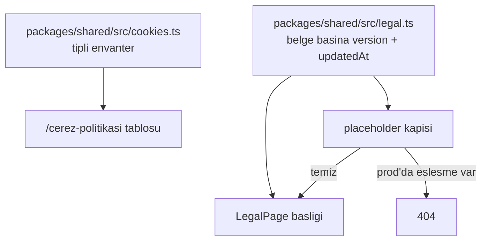

# Hukuki Yuzeyler, Durust Icerik ve Cerezsiz Olcum - Plan

> Bu belge hukuki danışmanlık değildir. Yayına almadan önce KVKK ve e-ticaret hukuku alanında çalışan bir avukat tarafından gerçek şirket bilgileri, veri akışları ve tedarikçiler üzerinden gözden geçirilmelidir.

## Goal Capsule

- **Amaç:** Public yüzeylerdeki ölü navigasyonu kaldırmak, dört hukuki sayfayı tam Türkçe metinle yayına hazırlamak, doğrulanamayan pazarlama iddialarını temizlemek ve ölçümü çerezsiz kurmak.
- **Yetki sırası:** `AGENTS.md` değişmezleri > bu plan > `ARCHITECTURE.md`. Çelişkide değişmezler kazanır.
- **Yürütme profili:** İki aşama sırayla. Aşama A yayınlanabilir bir bütündür; Aşama B onun üzerine ölçüm ve güven sinyallerini ekler.
- **Durma koşulları:** Uydurma şirket/tedarikçi/saklama bilgisi yazma — placeholder bırak. Ürünün bugün yapmadığı hiçbir şeyi metinde veya arayüzde iddia etme. Zorunlu olmayan çerez veya üçüncü taraf tracking script'i ekleme; bu plan tam da onu almamak üzerine kurulu.
- **Kuyruk sahipliği:** Commit'leri ana oturum atar. Deploy yalnızca `pnpm --filter @caka/web run deploy` ile (Değişmez #11).

---

## Product Contract

### Summary

Public nav ve footer yalnızca gerçekten var olan hedeflere link verecek; üç hukuki route (`/gizlilik`, `/kullanim-kosullari`, `/cerez-politikasi`) tam Türkçe metinle açılacak; landing'deki doğrulanamayan metrik, sosyal kanıt ve özellik vaatleri kaldırılacak; ölçüm çerezsiz Cloudflare Web Analytics ile kurulacak, böylece rıza banner'ı gerekmeyecek.

### Problem Frame

`apps/web/app/content/landing.ts` nav ve footer'ında on bağlantı hiçbir yere gitmiyor — gerçek olan tek anchor `#urun`. "Yasal" sütunundaki üç link (`#gizlilik`, `#kosullar`, `#cerezler`) dahil hepsi ölü; repoda hiçbir hukuki sayfa yok ve `docs/legal/` mevcut değil.

Aynı sayfa ürünün sağlamadığı şeyleri gösteriyor: "43.500 Tıklama / 643 Bülten kaydı / 960 Ziyaret" metrikleri (üründe analitik özelliği yok), "Türkiye'de 50 binden fazla yaratıcının tercihi" (ürün yayına çıkmadı), bir müşteri referansı ve dört kurgusal yaratıcı profili. SSS'te "içeriğini dışa aktarabilir ve hesabını tamamen silebilirsin" yazıyor; repoda hesap silme de dışa aktarma da yok.

Ölçüm tarafında bir seçim yapıldı ve bu planın şeklini belirledi. Google Analytics 4 değerlendirildi ve **şimdilik alınmadı**: ayırt edici değeri UTM kampanya atıfı ve Google Ads bağlantısı, ikisi de reklam harcaması olduğunda anlam kazanıyor ve yakın planda reklam yok. Buna karşılık GA4, KVKK'nın Temmuz 2025 çerez rehberi gereği açık rıza zorunluluğu getiriyordu; bu da her ziyaretçiye rıza banner'ı, bir tercih merkezi, cookie'ye göre değişen HTML ve yurt dışı aktarım için ayrı bir sözleşme süreci demekti. Trafik, referrer ve ülke verisi çerezsiz araçlarla zaten alınabiliyor. Sonuç: üründe bugün olduğu gibi **zorunlu olmayan hiçbir çerez bulunmuyor**, dolayısıyla rıza yükümlülüğü doğmuyor ve banner gerekmiyor. Aydınlatma yükümlülüğü ise koşulsuzdur ve bu plan onu karşılıyor.

### Requirements

**Navigasyon ve içerik dürüstlüğü**

- R23. Public nav ve footer yalnızca var olan, çalışan hedeflere link verir; ölü anchor bırakılmaz.
- R24. Nav ve footer link envanteri tek merkezî konumda (`apps/web/app/content/landing.ts`) tanımlanır; bileşenlere link gömülmez.
- R25. Landing, ürünün bugün sağlamadığı hiçbir metrik, sosyal kanıt, referans veya özellik vaadi göstermez.
- R26. `SiteFooter` tüm public pazarlama sayfalarında bulunur — ana sayfa ve üç hukuki sayfa dahil; `/:username` sayfalarında bulunmaz.
- R27. Footer sosyal ikonları yalnızca gerçekten aktif ve public Caka hesaplarına gider.

**Hukuki sayfalar**

- R28. Üç public route yayına alınır: `/gizlilik`, `/kullanim-kosullari`, `/cerez-politikasi`.
- R29. Aydınlatma metni KVKK m.10 ve Aydınlatma Tebliği m.5 unsurlarını taşır: veri sorumlusu kimliği, işleme amaçları, aktarım alıcı grupları ve amacı, toplama yöntemi ve her amaç için m.5/m.6 hukuki sebebi, m.11 hakları ve başvuru yolu.
- R30. Kullanım koşulları Caka'yı kullanıcı içeriği ve dış bağlantı platformu olarak tanımlar; yasak içerik, kaldırma/askıya alma yetkisi, hizmeti işletmek için sınırlı içerik lisansı, üçüncü taraf site sorumluluk reddi, hesap kapatma ve uygulanacak hukuk başlıklarını içerir.
- R31. Çerez politikası kullanılan her çerezi ad, amaç, kategori, süre ve birinci/üçüncü taraf bilgisiyle listeler ve kullanılmayan kategorileri açıkça belirtir.
- R32. Her hukuki sayfa `Son güncelleme` tarihi ve `Sürüm` bilgisi gösterir.
- R33. Doğrulanmamış şirket kimliği, tedarikçi ve saklama süresi bilgisi uydurulmaz; yayın öncesi doldurulacak her alan tek bir listede işaretlenir ve doldurulmadan sayfa prod'da yayınlanamaz.
- R34. Yeni route'lar ve yakın slug varyantları `packages/shared/src/username.ts` içindeki rezerve listeye eklenir ve `apps/web/app/routes.ts`'te `:username` catch-all'undan önce kaydedilir (Değişmez #1).
- R35. Hukuki sayfalar `sitemaps/core.xml` çıktısına dahil edilir.

**Ölçüm**

- R52. Ziyaretçi ölçümü çerezsiz kurulur: ziyaretçinin cihazına yazma veya cihazdan okuma yok, parmak izi yok, çapraz site takibi yok. Bu sayede rıza gerekmez ve banner gösterilmez.
- R53. Ölçüm aracının cihaza hiçbir şey yazmadığı uygulama sırasında doğrulanır; yazdığı görülürse çerez envanterine girer ve rıza duruşu yeniden değerlendirilir.
- R48. Bu planın kapsamı dışında inşa edilecek birinci taraf ziyaret/tıklama ölçümü (panel analitiği), çerez rejimini hiç tetiklemeyecek biçimde tasarlanır — ziyaretçi cihazına yazma veya cihazdan okuma yok — ve KD1'in üç koşulunu karşılar: ham IP saklanmaz, üçüncü tarafa aktarım yok, çapraz site takibi yok. Çerez rejiminin devreye girmemesi işlemeyi hukuki sebepten muaf tutmaz: işleme m.5/2-f meşru menfaate dayanır ve aydınlatma metninde bu sebeple yazılır.

**Güven sinyalleri**

- R49. Footer güven alanı yalnızca doğrulanabilir **ve ayırt edici** ifadeler gösterir; ISO 27001, GDPR uyumlu, KVKK uyumlu ve "%100 Türkiye'de barındırılıyor" gibi iddialar kullanılmaz.
- R50. Her güven ifadesinin teknik veya hukuki dayanağı `docs/legal/` altında kayıtlıdır.

**Audit çıktıları**

- R51. `docs/legal/` altında veri haritası, çerez envanteri ve tedarikçi kaydı üretilir; her tedarikçi için yurt dışı aktarım durumu belirtilir.

**Ertelenmiş — zorunlu olmayan bir araç eklendiğinde devreye girer**

Bu grup GA4 kararıyla birlikte ertelendi. R-ID'leri korunuyor; tasarımları Appendix'te duruyor ve araç geldiğinde olduğu gibi devreye alınabilir.

- R36–R45. Çerez rızası: rıza öncesi yükleme yasağı, aydınlatma/rıza ayrımı, eşit ağırlıklı seçenekler, retin kaydedilmesi, geri çekme kolaylığı, rıza kaydının şekli, JS'siz çalışma, `/:username` yalıtımı, bot muafiyeti, bozuk kayıt toleransı.
- R46–R47. Google Analytics 4: yüzey kapsamı ve ölçüm kimliği kapısı.

### Key Decisions

- **KD1. Çerez yükümlülüğünün kaynağı KVKK Temmuz 2025 Çerez Rehberi'dir** (Yayın No: 69). Çerezler 6698'e tabidir; EHK 5809 m.51/3 yalnızca lisanslı işletmecileri bağlar. §6 tüm çevrim içi davranışsal reklamcılığı rızaya bağlar. §5.9 birinci taraf analitiğini Kriter B kapsamında rıza muafı sayar, ama **üç koşula bağlı olarak** — bu test belgede yazılı durur, çünkü ileride eklenecek her ölçüm aracı aynı testten geçirilecek:
  1. Ölçüm yalnızca sitenin kendi kitlesini ölçer; **çapraz site takibi yoktur**.
  2. Veri **üçüncü tarafa aktarılmaz** ve üçüncü tarafın kendi amaçları için kullanılmaz.
  3. Veri minimize edilir (IP maskeleme önerilir), çıktı anonim istatistiktir ve çerez ömrü makuldür.
  *Governs R31, R52, R48.*
- **KD2. Aydınlatma yükümlülüğü koşulsuzdur, rıza koşulludur.** Rehber §9 ve Aydınlatma Tebliği m.5: hangi hukuki sebebe dayanılırsa dayanılsın aydınlatma yapılır. Bu yüzden üründe hiç rıza gerektiren çerez olmasa da `/gizlilik` ve `/cerez-politikasi` yayınlanır. (Tebliğ m.5/1-f'in aydınlatma ile açık rızayı ayrı işlemler sayan kuralı, rıza gerektiren bir araç eklendiğinde devreye girer — Appendix.) *Governs R28, R29, R31.*
- **KD3. Kanıtlanamayan uyum rozeti kullanılmaz.** Tedarikçinin sertifikası şirketin sertifikası değildir; taap.bio footer'ındaki ISO 27001 / SecNumCloud rozetleri arkasında sertifika numarası veya doğrulama sayfası olmadan duruyor ve kopyalanacak bir model değil. *Governs R49, R50.*
- **KD4. Google Analytics 4 şimdilik alınmıyor; ölçüm çerezsiz kurulur.** (session-settled: user-directed — rızaya bağlı GA4 kurulumu yerine seçildi: GA4'ün ayırt edici değeri UTM kampanya atıfı ve Google Ads bağlantısı, yakın planda reklam harcaması yok.) Bedeli açık ve kabul edildi: kampanya atıfı ve Ads bağlantısı yok, reklam verilmeye başlandığında GA4 yeniden değerlendirilir ve tasarımı Appendix'te hazır durur. Karşılığında rıza banner'ı, tercih merkezi, cookie'ye göre değişen HTML ve Google için ayrı bir yurt dışı aktarım sözleşmesi süreci düşer. *Governs R52, R36–R47.*

### Acceptance Examples

- AE7. **Legal slug çakışması sessizce sayfa karartmaz.** *Covers R34.* Prod D1'de `cerez-politikasi` adını tutan bir profil varsa route eklenmeden önce tespit edilir; route eklemek o yaratıcının sayfasını yönlendirmesiz karartırdı ve `username_redirect` bu durumu kapsamaz. İş durur ve kullanıcıya bildirilir.
- AE8. **Placeholder'lı hukuki metin prod'a çıkmaz.** *Covers R33.* Bir bölümde `[VERİ SORUMLUSU UNVANI]` kaldığı hâlde deploy edilirse, sayfa prod'da 404 döner; lokalde ve dev'de görünür bir uyarıyla render edilir.
- AE9. **Ölçüm cihaza dokunmaz.** *Covers R52, R53.* Ziyaretçi ana sayfayı açar; DevTools'ta ölçüm aracına ait hiçbir çerez, `localStorage` veya `sessionStorage` girdisi oluşmaz ve hiçbir rıza banner'ı gösterilmez.

### Scope Boundaries

#### Deferred to Follow-Up Work

- **Çerez rıza sistemi ve GA4** (R36–R47, KTD14–KTD20, KTD24–KTD29, U20–U25, AE1–AE6). Tasarımı Appendix'te tam hâliyle duruyor. Reklam harcaması başladığında veya zorunlu olmayan başka bir araç eklendiğinde devreye alınır.
- **Uzak `ogImage` için Worker proxy'si** (KTD23). Profil sahibinin yapıştırdığı host, görsel yanıtında `Set-Cookie` göndererek ziyaretçiye üçüncü taraf çerezi yazabilir. GA4 kararından bağımsız, bugün de var olan bir sızıntı; bu planın kapsamı dışında ama `docs/backlog.md`'ye yazılır ve `/gizlilik`'te açıklanır.
- **Fontshare fontlarını self-host etmek.** Aydınlatmadaki açıklama yükümlülüğünü tamamen kaldırır ve iki preconnect'i düşürür.
- **Panel analitiği — birinci taraf ziyaret/tıklama ölçüm hattı** (Analytics Engine veya D1 append-only tablo + gecelik toplulaştırma). Bu plan yalnızca R48'deki tasarım kısıtını sabitler. Cloudflare Web Analytics bunun yerine geçmez: o Caka ekibinin pazarlama ölçümü, bu ise yaratıcının kendi sayfasında gördüğü veri.
- **Self-servis veri dışa aktarma ve hesap silme arayüzü.** Hesap silme MVP planında R19 olarak zaten var ve uygulanmamış; bu plan yalnızca yanlış SSS vaadini kaldırır ve hukuki metinde manuel başvuru yolunu tanımlar.
- **İlgili kişi başvuru yordamı** (`docs/legal/ilgili-kisi-basvuru.md`): başvuru kutusu, kimlik doğrulama, D1/R2'den veri çıkarma, 30 günlük süre takibi. Aydınlatma metni 30 gün taahhüdü verdiği için yayından önce en azından bir sorumlu ve bir kutu belirlenmeli.
- **R21 güvenlik başlıkları ve CSP middleware'i.**
- **`/og/u/*` için zone seviyesinde WAF rate limit** (`docs/backlog.md` #1).
- **Mesafeli satış, ön bilgilendirme, iptal-iade-cayma metinleri.** Ücretli plan ve ödeme akışı yokken erken.

#### Kapsam dışı

- Rıza banner'ı. Üründe rıza gerektiren hiçbir çerez yok; banner koymak, olmayan bir yükümlülük için her ziyaretçiyi kesintiye uğratmak olurdu.
- `/cerez-tercihleri` sayfası. Yönetilecek bir tercih yokken tercih merkezi tiyatrodur. Slug yine de rezerve edilir (U14) ki ileride çakışma çıkmasın.
- ISO 27001, GDPR Compliant, "KVKK uyumlu", "%100 Türkiye'de barındırılıyor", "cookie-free analytics" rozetleri.
- VERBİS kaydı. Kurul 2025/1572 sonrası muafiyet eşiği (<50 çalışan ve <100M TL bilanço) Caka'yı kapsıyor.

### Outstanding Questions

**Yayın öncesi zorunlu (uygulamayı engellemez, canlıya çıkışı engeller)**

- OQ1. Veri sorumlusunun gerçek kimliği: ticari unvan veya gerçek kişi ad-soyad, vergi/MERSİS numarası, posta adresi, KVKK başvuru e-postası, destek e-postası. Metinler placeholder ile yazılır; U15'teki placeholder kapısı bunlar doldurulmadan sayfaları prod'da 404'e düşürür.
- OQ2a. **Cloudflare aktarım mekanizması.** 7499 sayılı değişiklik sonrası (01.06.2024) açık rıza artık yalnızca arızi hâllerden biri; rutin ve sistematik aktarımlar buna dayanamaz. Uygulama, veritabanı, dosya depolama ve loglar bugün zaten Cloudflare'de — yani bu, GA4'ten bağımsız ve **bugün mevcut** bir açık. m.9'un kademeli rejiminde yeterlilik kararı (bugün yok), uygun güvenceler (Kurul onaylı standart sözleşme — imzadan itibaren beş iş günü içinde Kurum'a bildirim; taahhütname + Kurul izni; bağlayıcı şirket kuralları) ve arızi hâller var. Aydınlatma metni gerçek mekanizmayı adıyla yazmalıdır; "yurt dışına aktarılabilir" demek yetmez. Aynı soru U28'in ölçüm aracı için de geçerli.
- OQ3. Avukat incelemesi. Özellikle kullanım koşullarındaki sorumluluk sınırlaması, uygulanacak hukuk ve yetki maddeleri ile aydınlatma metnindeki hukuki sebep eşleştirmeleri.
- OQ4. Footer sosyal hesapları (`github.com/caka-app`, `x.com/cakaapp`, `instagram.com/caka.app`) gerçekten aktif ve public mi? `destek@caka.app` ve `merhaba@caka.app` teslim alıyor mu? Almayanlar ölü link sayılır ve kaldırılır.

**Ertelenmiş**

- OQ5. Reklam harcaması başladığında GA4 mi, sunucu tarafı UTM yakalama mı? İkincisi çerezsiz kalır ama Ads bağlantısı vermez.
- OQ6. "Tekil ziyaretçi" metriği cihaza yazmadan üretilemiyor; metrikten vazgeçmek ya da günlük dönen tuzlu IP+UA hash'i kullanmak arasında bir karar, panel analitiği işine devredilir.

### Sources

- KVKK, Çerez Uygulamaları Hakkında Rehber, Yayın No: 69, Temmuz 2025 — https://www.kvkk.gov.tr/SharedFolderServer/CMSFiles/fb193dbb-b159-4221-8a7b-3addc083d33f.pdf (§4 Kriter A/B, §5.8, §5.9, §6, §7, §8, §9)
- Aydınlatma Yükümlülüğünün Yerine Getirilmesinde Uyulacak Usul ve Esaslar Hakkında Tebliğ, RG 10.03.2018/30356 — https://www.resmigazete.gov.tr/eskiler/2018/03/20180310-5.htm
- Kurul 23.12.2022, 2022/1358 — https://www.kvkk.gov.tr/Icerik/7595/2022-1358 (reklam çerezleri hukuki sebepsiz; m.12/1 ihlali, 300.000 TL)
- KVKK, Yurtdışına Aktarım — https://www.kvkk.gov.tr/Icerik/2053/Yurtdisina-Aktarim
- Kurul 04.09.2025, 2025/1572, RG 01.10.2025 — VERBİS muafiyet eşiği
- Cloudflare, privacy-first Web Analytics — https://blog.cloudflare.com/privacy-first-web-analytics/ ("We don't use any client-side state (like cookies or localStorage) for analytics purposes")
- Cloudflare, Web Analytics FAQ — https://developers.cloudflare.com/web-analytics/faq/ (query string tutulmaz → UTM atıfı yok)
- Google, Consent mode overview — https://developers.google.com/tag-platform/security/concepts/consent-mode (Appendix'teki GA4 tasarımının dayanağı)

---

## Planning Contract

### Key Technical Decisions

- KTD21. **Çerez envanteri `packages/shared` içinde tipli tek kaynaktır.** `/cerez-politikasi` tablosu bu diziden render edilir. Her hukuki belge kendi `version` ve `updatedAt` alanını taşır — üçü aynı gün yayınlansa da sonradan yalnızca biri değişebilir ve diğerlerinin tarihini oynatmak metni gerçeğe aykırı hâle getirir. Envanteri kodda tek kaynak tutmanın asıl kazancı ileride: yeni bir çerez eklenip politika unutulduğunda tablo ile gerçek arasında sessiz bir kayma oluşurdu.
- KTD22. **Hukuki metinler yapılandırılmış içerik modülleri olarak yazılır.** `apps/web/app/content/legal/` altında bölüm dizileri (`{id, heading, blocks}`), ortak bir `LegalPage` bileşeniyle render edilir. `landing.ts`'in kısa etiket deseni uzun metne uymuyor, ama Değişmez #5'in ruhu (metin bileşende değil içerikte) korunur; sürüm ve tarih metinle aynı yerde durur.
- KTD23. **Cihaza dokunmayan üçüncü taraflar aydınlatmaya konudur; uzak `ogImage` ise ayrı bir sınıftır.**
  - **Fontshare** (`root.tsx`, `api.fontshare.com` + `cdn.fontshare.com`, her sayfada) bir stil sayfası ve font dosyası çeker; cihaza hiçbir şey yazmaz. Doğru yükümlülük tedarikçi kaydı ve aydınlatma metnidir. Self-host etmek yükümlülüğü tamamen kaldırır — ertelenen iş.
  - **Uzak `ogImage`** (`profile-block.tsx:101`) farklıdır: host'u profil sahibi seçiyor ve o host, görsel yanıtında `Set-Cookie` göndererek ziyaretçinin cihazına üçüncü taraf çerezi yazabilir; tüm Caka profillerinde aynı çerezle ziyaretçi eşleyebilir. `referrerPolicy="no-referrer"` yalnızca `Referer`'ı keser — çerezi de IP/UA sızıntısını da engellemez. Gerçek çözüm Worker proxy'sidir ve bu planın kapsamı dışına alınmıştır; `/gizlilik` bu isteği açıklar, `docs/backlog.md` işi kaydeder.
- KTD30. **Ölçüm Cloudflare Web Analytics ile kurulur.** Yığında zaten var, ücretsiz ve **yapı gereği çerezsiz** — Cloudflare kendi ifadesiyle analitik için hiçbir istemci tarafı durum (çerez, localStorage) kullanmıyor ve parmak izini çerezden daha müdahaleci sayıyor. Bu, KD1'in üç koşulunu karşılar ve rıza yükümlülüğü doğurmaz. Bilinen sınırları peşinen kabul ediliyor: reklam engelleyiciler beacon'ı engeller, query string tutulmadığı için **UTM kampanya atıfı yoktur** ve Google Ads bağlantısı kurulamaz. Bu üçü de KD4'ün kabul ettiği bedelin parçası. *Governs R52.*
- KTD31. **Ölçüm aracının çerezsizliği iddia edilmez, doğrulanır.** `/cerez-politikasi` "ölçüm çerezi kullanmıyoruz" diyecek; bu ifade beacon'ın cihaza gerçekten hiçbir şey yazmadığı DevTools'ta görülmeden yazılmaz. Yazdığı görülürse envantere girer ve rıza duruşu yeniden değerlendirilir — planın dürüstlük ilkesi kendi ölçüm aracına da uygulanır. *Governs R53.*

### High-Level Technical Design

**Üçüncü taraf yüzey matrisi.** Rıza kapısı gerektiren hiçbir satır yok; hepsi ya cihaza dokunmuyor ya da kullanıcı eylemiyle tetikleniyor. Yükümlülük tek tip: aydınlatma metninde ve tedarikçi kaydında açıklamak.

| Yüzey | Ne oluyor | Cihaza yazıyor mu | Yükümlülük |
|---|---|---|---|
| Cloudflare (Workers, D1, R2, Logs) | Barındırma ve veri işleme | — | Aydınlatma + OQ2a aktarım mekanizması |
| Cloudflare Web Analytics | Beacon, sayfa görüntüleme sayımı | Hayır (doğrulanacak, U28) | Aydınlatma |
| Fontshare | Her sayfada font ve stil sayfası | Hayır | Aydınlatma + tedarikçi kaydı |
| Google / Apple OAuth | Kullanıcı girişi başlattığında yönlendirme | Kendi alanlarında | Aydınlatma; kesinlikle gerekli |
| Uzak `ogImage` (`/:username`) | Profil sahibinin seçtiği hosttan görsel | **Evet — `Set-Cookie` mümkün** | Aydınlatma; proxy ertelendi |
| GitHub katkı API'si | Yalnızca sunucudan çağrılır | Hayır | Aydınlatma (üçüncü kişi verisi) |

**Çerez envanteri ve sayfa sürümü ilişkisi.** Politikanın tablosu koddan, tarihi ise belge sabitinden gelir; ikisi ayrı yerlerde tutulursa envanter değişip tarih sabit kalır ve politika sessizce yanlışa düşer.

### Assumptions

- Footer'daki üç sosyal hesap ve iki e-posta adresi gerçektir; aksi doğrulanırsa U13'te kaldırılır (OQ4).
- Prod D1'de yeni legal slug'ları kullanıcı adı olarak tutan profil yoktur; U14 bunu doğrular.
- KVKK m.11 hakları, self-servis araç olmadan e-posta başvurusuyla ve 30 gün içinde manuel karşılanır. Hukuki metin bu yolu tanımlar; yordamın kendisi ertelenmiş iştir.
- Cloudflare Web Analytics, Workers ile servis edilen bir sitede çalışır. Otomatik enjeksiyonun bu kurulumda geçerli olup olmadığı U28'de doğrulanır; olmuyorsa beacon elle eklenir.

### Sequencing

Aşama A tek başına yayınlanabilir bir bütündür ve en yüksek getiriyi sağlar: ölü linkler ve yanlış iddialar kalkar, hukuki sayfalar açılır. Yayın kapısı OQ1, OQ2a ve OQ3'tür.

Aşama B ölçümü ve güven alanını ekler. U28 (ölçüm) U19'a bağlıdır — çerez politikası, ölçüm aracının gerçekte ne yaptığı doğrulanmadan yazılamaz. U26 (güven alanı) ve U27 (audit çıktıları) en sonda gelir; ikisi de kendinden önceki birimlerin ürettiği gerçeği kaydeder.

---

## Implementation Units

### Unit Index

| U | Başlık | Ana dosyalar | Bağımlılık |
|---|---|---|---|
| U13 | Ölü linkleri ve doğrulanamayan iddiaları kaldır | `app/content/landing.ts`, `components/landing/*`, `routes/home.tsx` | — |
| U14 | Üç route, rezerve isimler, sitemap | `app/routes.ts`, `packages/shared/src/username.ts`, `server/seo.ts` | — |
| U15 | Hukuki sayfa iskeleti, sürüm sabitleri, placeholder kapısı | `app/components/legal-page.tsx`, `packages/shared/src/legal.ts` | U14 |
| U16 | Çerez envanteri tek kaynağı | `packages/shared/src/cookies.ts` + test | — |
| U17 | `/gizlilik` aydınlatma metni | `app/content/legal/gizlilik.ts`, `app/routes/gizlilik.tsx` | U15, U16 |
| U18 | `/kullanim-kosullari` metni | `app/content/legal/kullanim-kosullari.ts`, `app/routes/kullanim-kosullari.tsx` | U15 |
| U19 | `/cerez-politikasi` metni ve tablosu | `app/content/legal/cerez-politikasi.ts`, `app/routes/cerez-politikasi.tsx` | U15, U16 |
| U28 | Çerezsiz ölçüm (Cloudflare Web Analytics) | `app/root.tsx`, `docs/legal/vendor-register.md` | U19 |
| U26 | Footer güven alanı | `app/content/landing.ts`, `components/landing/site-footer.tsx` | U13, U28 |
| U27 | `docs/legal/` audit çıktıları ve depo belgeleri | `docs/legal/*.md`, `AGENTS.md`, `ARCHITECTURE.md`, `docs/backlog.md` | U16, U17, U18, U26, U28 |

U20–U25 bu planda yürütülmez; tasarımları Appendix'te durur.

---

### Aşama A — Navigasyon, hukuki yüzeyler, dürüst içerik

### U13. Ölü linkleri ve doğrulanamayan iddiaları kaldır

**Goal:** Public nav ve footer yalnızca çalışan hedeflere gitsin; landing ürünün sağlamadığı hiçbir şeyi iddia etmesin.

**Requirements:** R23, R24, R25, R27.

**Dependencies:** Yok.

**Files:**
- `apps/web/app/content/landing.ts` (nav 93-98, footer 203-249, metrikler 136-144, proof 146-156, quote 157-163, SSS 188-190, marquee 114-117)
- `apps/web/app/components/landing/audience-section.tsx`
- `apps/web/app/components/landing/proof-section.tsx`
- `apps/web/app/components/landing/quote-section.tsx`
- `apps/web/app/components/landing/hero-marquee.tsx`
- `apps/web/app/components/landing/faq-section.tsx`
- `apps/web/app/components/landing/navbar.tsx`
- `apps/web/app/components/landing/site-footer.tsx`
- `apps/web/app/routes/home.tsx` (kaldırılan bölümlerin render sırası, 115-116)
- `apps/web/app/assets/landing/` (adım 10'da referanssız kalan görseller)

**Approach:**

1. Nav'da yalnızca gerçek anchor'ı bırak: `Ürün` → `#urun`. `Şablonlar`, `Örnekler`, `Fiyat` kaldırılır.
2. Footer sütunlarını yeniden kur. `Ürün`: yalnızca `Nasıl çalışır` → `#urun`. `Kaynaklar`: yalnızca `Destek` → `mailto:destek@caka.app` (`Blog` kaldırılır). `Şirket`: yalnızca `İletişim` → `mailto:merhaba@caka.app` (`Hakkımızda` ve `Kariyer` kaldırılır). `Yasal`: üç gerçek route (`/gizlilik`, `/kullanim-kosullari`, `/cerez-politikasi`).
3. Tek bağlantısı kalan sütunları birleştir veya kaldır; iki-üç dolu sütun, dördü yarı boş sütundan iyidir. Bileşenin sütun sayısına göre esneyip esnemediğini kontrol et.
4. `audience` bölümündeki üç uydurma metriği kaldır. Bölümün kendisi ("Kitleni tanı, ilgisini koru") ürün vaadi olarak kalabilir ama sayı gösteremez; `Metric` tipi ve `metrics` alanı kullanılmıyorsa tiplerden de sil.
5. `proof` bölümündeki "Türkiye'de 50 binden fazla yaratıcının" iddiasını ve dört kurgusal yaratıcı görselini kaldır; bölümü tamamen çıkar.
6. `quote` bölümündeki Deniz Aksu referansını kaldır; bölümü tamamen çıkar.
7. Hero marquee'deki dört kurgusal yaratıcı adını ve mesleğini kaldır; yalnızca görseller kalsın. Gerçek kişi izlenimi veren isim ve unvan bırakma.
8. SSS'teki dışa aktarma ve hesap silme vaadini gerçek duruma çek: her ikisi de bugün self-servis değil. Doğru metin, KVKK m.11 kapsamında e-posta başvurusuyla talep edilebileceğini söyler.
9. `landing.ts`'te kalan hiçbir `href` `#` ile başlayıp karşılığı olmayan bir anchor'a gitmemeli. Kalan tek geçerli anchor `#urun`.
10. Kullanılmayan görsel importlarını ve `~/assets/landing/` altında artık referans verilmeyen dosyaları temizle.

**Patterns to follow:** Değişmez #5 — tüm metin ve linkler `content/landing.ts`'te; bileşene metin gömme. Bölüm kaldırırken `routes/home.tsx`'teki render sırasından da çıkar.

**Test scenarios:**
- `landing.ts` içinde `href` değeri `#` ile başlayan tek giriş `#urun`'dür (grep ile doğrulanır).
- Ana sayfa `pnpm dev` altında kaldırılan bölümler olmadan hatasız render olur; konsolda eksik import hatası yok.
- Kaldırılan `Metric`, `ProofSection`, `QuoteSection` tipleri hiçbir yerden import edilmiyor (`pnpm typecheck`).
- Footer'daki her `mailto:` adresi gerçek bir kutuya gidiyor (manuel, OQ4).

**Verification:** `pnpm typecheck` temiz; ana sayfa lokalde açılıyor; nav ve footer'daki her bağlantı ya çalışan bir anchor'a ya `mailto:`'ya ya da (U14 sonrası) 200 dönen bir route'a gidiyor.

---

### U14. Üç route, rezerve isimler ve sitemap

**Goal:** Üç hukuki route var olsun, kullanıcı adı olarak kapılamasın ve arama motorlarına doğru bildirilsin.

**Requirements:** R28, R34, R35.

**Dependencies:** Yok.

**Files:**
- `apps/web/app/routes.ts`
- `packages/shared/src/username.ts` (Türkçe karşılıklar grubu — "route/auth/yasal/altyapı", ~124-132; **`RESERVED_GROUPS.legal` değil**, o grup ödeme/İngilizce terimleri taşıyor)
- `packages/shared/src/username.test.ts`
- `apps/web/server/seo.ts` (statik sitemap, 79-81)
- `apps/web/app/routes/gizlilik.tsx`, `kullanim-kosullari.tsx`, `cerez-politikasi.tsx` (iskelet)

**Approach:**

1. **Önce çakışma kontrolü.** Türkçe karşılıklar grubu bugün `gizlilik`, `gizlilik-politikasi`, `kosullar`, `kullanim-sartlari`, `cerez`, `cerezler`, `yasal` içeriyor; `privacy`, `terms`, `legal`, `kvkk`, `gdpr` ise `RESERVED_GROUPS.legal`'da. `kullanim-kosullari`, `cerez-politikasi` ve `cerez-tercihleri` **hiçbirinde yok** ve `USERNAME_PATTERN` tire kabul ettiği için bunlar bugün alınabilir kullanıcı adları. Prod D1'de bu adları tutan profil var mı, route eklemeden **önce** sorgula. Varsa route eklemek o profili karartır ve `username_redirect` bu durumu kapsamaz — o hâlde durup kullanıcıya bildir (AE7).
2. Eksik slug'ları Türkçe karşılıklar grubuna ekle: `kullanim-kosullari`, `cerez-politikasi` ve yakın varyantlar. **`cerez-tercihleri` de rezerve edilir** — bu planda route olarak açılmıyor ama ileride rıza sistemi geldiğinde kullanılacak ve o zamana kadar kapılmamalı.
3. Üç route'u `routes.ts`'te `:username`'den önce kaydet.
4. `packages/shared/src/username.test.ts`'e slug'ların rezerve olduğunu doğrulayan bir test ekle. Tam route-tablosu senkron testi mümkün değil (`packages/shared`, `apps/web/app/routes.ts`'i import edemez); bu boşluğu testin yorumunda belirt.
5. `server/seo.ts`'teki statik sitemap girdilerine `/gizlilik`, `/kullanim-kosullari`, `/cerez-politikasi` ekle.
6. Üç route dosyasını iskelet olarak oluştur: `meta` export'u, `Navbar`, `SiteFooter`.

**Patterns to follow:** `apps/web/app/routes/home.tsx` — `meta({loaderData})` + `buildSeoMeta` (`~/lib/seo`), `
<Navbar/><main>…</main><SiteFooter/>
` iskeleti. Değişmez #1.

**Test scenarios:**
- `validateUsername("kullanim-kosullari")`, `("cerez-politikasi")`, `("cerez-tercihleri")`, `("gizlilik")` çağrılarının dördü de `{ ok: false, error: "reserved" }` döner — mevcut "rezerve adresi reddeder" bloğuyla aynı desen. (`isReservedUsername` diye bir export yok.)
- Üç route lokalde 200 döner.
- `sitemaps/core.xml` üç hukuki URL'yi içerir.
- `:username` catch-all'u hâlâ bilinmeyen bir adı yakalıyor (regresyon).

**Verification:** `pnpm test` yeşil; üç URL lokalde açılıyor; prod D1 çakışma sorgusu çalıştırıldı ve sonucu raporlandı.

---

### U15. Hukuki sayfa iskeleti, sürüm sabitleri ve placeholder kapısı

**Goal:** Üç hukuki sayfa aynı yapıdan render olsun, sürüm ve tarih tek yerden gelsin, doldurulmamış metin prod'a çıkmasın.

**Requirements:** R26, R32, R33.

**Dependencies:** U14.

**Files:**
- `packages/shared/src/legal.ts` (yeni — belge başına `version` / `updatedAt`, `LegalSection` ve `LegalBlock` tipleri)
- `packages/shared/src/legal.test.ts` (yeni)
- `packages/shared/src/index.ts` (yeni modülü re-export et — `apps/web` yalnızca bu giriş noktasından tüketebiliyor)
- `apps/web/app/components/legal-page.tsx` (yeni)
- `apps/web/app/components/rich-text.tsx` (mevcut deseni incele, yeniden kullanılabilir mi)

**Approach:**

1. `packages/shared/src/legal.ts` içinde her hukuki belge için ayrı `version` ve `updatedAt` tanımla — üçü aynı gün yayınlansa da sonradan yalnızca biri değişebilir.
2. `LegalSection` tipini tanımla: `{id, heading, blocks}`. `LegalBlock` varyantları: paragraf, madde listesi, tablo. **Paragraf ve liste blokları satır içi bağlantı taşıyabilmelidir** — U17 bölüm 9, U18 bölüm 12 ve U19 bölüm 5-6 birbirine link vermek zorunda; mekanizmayı burada tanımla (`rich-text.tsx` desenini yeniden kullan), yoksa her içerik modülü kendi çözümünü uydurur.
3. `LegalPage` bileşeni: başlık, `Son güncelleme` / `Sürüm` satırı, bölüm içeriği, üç hukuki sayfa arasında gezinme bağlantıları. Yalnızca `app.css` `@theme` token'larını kullanır (Değişmez #4).
4. Bölüm başlıklarına `id` ver; içerik modülleri birbirine `#bolum-id` ile link verebilsin. Kırık iç bağlantı riskini test ile kapat.
5. **Placeholder kapısı.** `LegalPage`, render'dan önce bölüm bloklarında `[...]` kalıbını tarar; prod ortamında eşleşme bulursa sayfa 404 döner, dev ve lokalde görünür bir uyarıyla render edilir. Deploy çalıştığında `[VERİ SORUMLUSU UNVANI]` gibi alanlar ziyaretçiye görünür hâle gelir ve bunu bugün yalnızca bir kontrol listesi engelliyor (AE8).
6. **Okunabilirlik.** Paragraf blokları sınırlı bir okuma genişliğinde (`max-w-prose` mertebesi) render edilir — pazarlama yüzeylerinin tam genişliği uzun hukuki metinde okunmaz. Tablo blokları yatay kaydırılabilir bir kapsayıcıda ve dar ekranda görünür bir kaydırma işaretiyle render edilir; repoda hazır bir duyarlı tablo deseni yok.
7. Üç route'u `LegalPage` kullanacak biçimde bağla ve `SiteFooter`'ı hepsine ekle (R26).

**Patterns to follow:** `apps/web/app/components/rich-text.tsx` — yapılandırılmış içeriği render eden mevcut bileşen; şeklini ve satır içi işaretleme yaklaşımını örnek al.

**Test scenarios:**
- Üç belgenin her biri kendi `version` ve `updatedAt` alanına sahiptir ve hiçbiri boş değildir.
- Bir içerik modülü var olmayan bir bölüm `id`'sine link verirse test kırılır.
- `LegalPage`, boş `blocks` dizisi olan bir bölümü hatasız render eder.
- Köşeli parantezli placeholder taşıyan bir içerik modülü prod ortamında render edilmez, dev'de uyarıyla render edilir.

**Verification:** `pnpm test` yeşil; üç sayfa `Son güncelleme` ve `Sürüm` satırıyla, footer'la birlikte render oluyor; placeholder'lı bir bölümle prod modunda 404 alındığı doğrulandı.

---

### U16. Çerez envanteri tek kaynağı

**Goal:** Hangi çerezin var olduğu tek bir tipli yerde yazılı olsun; politika tablosu oradan render edilsin.

**Requirements:** R31.

**Dependencies:** Yok.

**Files:**
- `packages/shared/src/cookies.ts` (yeni)
- `packages/shared/src/cookies.test.ts` (yeni)
- `packages/shared/src/index.ts` (re-export)

**Approach:**

1. `CookieEntry` tipi: `{name, category, purpose, lifetime, party, provider}`. `category` bugün tek değer alır: `zorunlu`. Tip birliğini genişletilebilir bırak ama bugün var olmayan kategoriyi tanımlama.
2. Bugünkü gerçek envanteri gir — repoda doğrulanan hâliyle, tahminle değil:
   - Better Auth oturum çerezi (`apps/web/server/auth.ts`; `advanced.cookies` yapılandırılmamış, yani Better Auth 1.6.28 varsayılanları geçerli — **adını ve ömrünü kütüphaneden doğrula, uydurma**), kategori `zorunlu`.
   - Better Auth OAuth state / PKCE / nonce çerezleri, kategori `zorunlu`.
   - `caka_claim` (`apps/web/app/routes/onboarding.tsx:123`, `Max-Age=900`, `SameSite=Lax`, `Path=/`, `Secure` yok — `document.cookie` ile yazıldığı için `HttpOnly` mümkün değil, bunu `purpose` alanında belirt), kategori `zorunlu`.
3. `_ga` / `_ga_<ID>` **girilmez** — GA4 alınmadı (KD4). Analitik ve pazarlama kategorileri de tanımlanmaz.
4. Envanteri okuyup tablo satırına dönüştüren saf bir yardımcı yaz; `/cerez-politikasi` bunu kullanır.

**Patterns to follow:** `packages/shared/src/layout.ts` — `as const` dizi + tip türetme deseni.

**Test scenarios:**
- Her girdinin `purpose` alanı boş değil.
- Her girdinin `category` değeri bilinen birliğe ait.
- Aynı `name` iki kez geçmiyor.
- `party: "üçüncü"` olan her girdide `provider` dolu.

**Verification:** `pnpm test` yeşil.

---

### U17. `/gizlilik` — Aydınlatma ve Gizlilik Metni

**Goal:** KVKK m.10 ve Aydınlatma Tebliği m.5 unsurlarını taşıyan, Caka'nın gerçek veri akışını anlatan tam Türkçe metin.

**Requirements:** R29, R32, R33.

**Dependencies:** U15, U16.

**Files:**
- `apps/web/app/content/legal/gizlilik.ts` (yeni)
- `apps/web/app/routes/gizlilik.tsx`

**Approach:**

Metni tam yaz. Doğrulanmamış her bilgi için köşeli parantezli placeholder bırak ve hepsini U27'deki tek listeye ekle.

Bölümler:

1. **Veri sorumlusu ve iletişim** — `[VERİ SORUMLUSU UNVANI]`, `[VERGİ / MERSİS NO]`, `[POSTA ADRESİ]`, `[KVKK BAŞVURU E-POSTASI]`.
2. **Kapsam** — `caka.app` pazarlama sitesi, hesap ve panel, public Caka profilleri, destek yazışmaları.
3. **İşlenen veri kategorileri** — repodaki gerçek şemadan yazılır: hesap verisi (`user`: ad, e-posta, e-posta doğrulama durumu, profil görseli), kimlik sağlayıcı verisi (`account`: sağlayıcı kimliği, token'lar), oturum verisi (`session`: **IP adresi, User Agent**, süre), profil içeriği (`profile`: kullanıcı adı, tema, `layout` JSON içindeki ad, bio, linkler, sosyal handle'lar, zengin metin), yüklenen dosyalar (`asset` → R2), adres değişikliği kaydı (`username_redirect`), GitHub katkı grafiği önbelleği (`github_calendar` — anahtar, profilde gösterilmek üzere eklenen GitHub hesabının kullanıcı adıdır ve **bu hesap profil sahibine ait olmayabilir**; yani Caka'da hesabı olmayan bir ilgili kişinin verisi işlenmiş olur), operasyon kayıtları (Cloudflare Workers Logs, `wrangler.jsonc` `observability.enabled: true`), çerezsiz ziyaret istatistikleri (U28).
4. **İşleme amaçları ve hukuki sebepler** — her amaç için KVKK m.5 bendini adıyla yaz: hesap kurulması ve sözleşmenin ifası (m.5/2-c), public profilin yayınlanması (m.5/2-c), güvenlik ve kötüye kullanım önleme (m.5/2-f meşru menfaat), destek taleplerinin yanıtlanması (m.5/2-c veya m.5/2-f), yasal yükümlülükler (m.5/2-ç), üçüncü kişiye ait GitHub hesabının katkı grafiğinin önbelleklenmesi (m.5/2-f, önbellek ömrü belirtilerek), çerezsiz ziyaret istatistikleri (m.5/2-f). Genel "kişisel verilerimin işlenmesini kabul ediyorum" ifadesi kullanılmaz (rehber §7).
5. **Toplama yöntemi** — elektronik ortamda, kullanıcının doğrudan girdisi, kimlik sağlayıcısından dönen veri, otomatik sunucu kayıtları ve zorunlu çerezler yoluyla.
6. **Aktarım ve tedarikçiler** — U27'deki tedarikçi kaydından türetilir. Bilinen tedarikçiler ve rolleri: Cloudflare (Workers barındırma, D1, R2, CDN, Workers Logs, Web Analytics), Google (Sign in with Google), Apple (Sign in with Apple), Indian Type Foundry / Fontshare (font sunumu — her sayfa yüklemesinde ziyaretçinin IP'si ve User Agent'ı bu servise ulaşır), GitHub (katkı grafiği; yalnızca sunucu tarafından çağrılır, ziyaretçinin tarayıcısı GitHub'a istek atmaz). Ayrıca profil sayfalarında, profil sahibinin eklediği bağlantıların önizleme görselleri **o sitelerin sunucularından doğrudan ziyaretçinin tarayıcısına** çekilir; bu isteklerde IP ve User Agent o siteye ulaşır ve o site tarayıcıya çerez yazabilir (KTD23). **Yurt dışına aktarım mekanizması `[AKTARIM MEKANİZMASI]` olarak bırakılır** — OQ2a çözülmeden bu boşluk doldurulamaz ve mekanizması adı geçmeyen bir ifade yeterli değildir.
7. **Saklama süreleri** — `[SAKLAMA SÜRELERİ]` placeholder'ı; bilinen teknik gerçekler yazılır (adres değişikliğinde eski adres 30 gün, `username_redirect`), geri kalanı doldurulacak.
8. **İlgili kişi hakları ve başvuru** — m.11 haklarını sayar; başvurunun `[KVKK BAŞVURU E-POSTASI]` üzerinden yapıldığını, kimlik doğrulaması istenebileceğini ve 30 gün içinde yanıtlanacağını yazar. **Dışa aktarma ve hesap silmenin bugün self-servis olmadığını, bu yolla talep edildiğini açıkça belirtir** — SSS'teki eski vaadin tersine. Ayrıca Caka'da hesabı olmayan üçüncü kişilerin de (örneğin katkı grafiği önbelleğinde adı geçen GitHub hesabının sahibi) aynı adresten silme talep edebileceğini yazar.
9. **Çerezler** — kısa özet: yalnızca zorunlu çerezler kullanılıyor, ölçüm çerezsiz yapılıyor, reklam ve analitik çerezi yok. Ayrıntı için `/cerez-politikasi`'na bağlantı.
10. **Çocukların gizliliği** — `[YAŞ SINIRI]` politikası.
11. **Değişiklikler** — güncelleme mekanizması ve sürüm bilgisi.

**Test scenarios:** `Test expectation: none -- içerik modülü; doğrulama tip kontrolü, iç bağlantı ve placeholder testleri (U15) ve insan incelemesiyle yapılır.`

**Verification:** `pnpm typecheck` temiz; sayfa dev modunda render oluyor; metinde kalan her placeholder U27'deki listede yer alıyor; hiçbir tedarikçi, süre veya şirket bilgisi uydurulmamış.

---

### U18. `/kullanim-kosullari` — Kullanım Koşulları

**Goal:** Caka'yı kullanıcı içeriği ve dış bağlantı platformu olarak tanımlayan tam Türkçe sözleşme metni.

**Requirements:** R30, R32, R33.

**Dependencies:** U15.

**Files:**
- `apps/web/app/content/legal/kullanim-kosullari.ts` (yeni)
- `apps/web/app/routes/kullanim-kosullari.tsx`

**Approach:**

Bölümler:

1. **Taraflar ve hizmetin tanımı** — `[VERİ SORUMLUSU UNVANI]` ile kullanıcı arasında; Caka'nın link-in-bio barındırma hizmeti olduğu.
2. **Hesap açma ve hesap güvenliği** — kimlik sağlayıcı ile giriş, kullanıcı adı tahsisi, hesabın güvenliğinden kullanıcının sorumlu olması.
3. **Kullanıcı adı politikası** — rezerve isimler, adres değişikliğinde eski adresin 30 gün 302 ile yönlendirilmesi ve kilitli kalması (Değişmez #10), kötüye kullanım hâlinde geri alma.
4. **Kullanıcı içeriği ve sorumluluk** — kullanıcı, profilinde yayınladığı her metin, görsel, dosya, marka ve bağlantının hukuka uygunluğundan; bağlantı verdiği üçüncü taraf sitelerden; gerekli izin, telif, marka ve kişisel veri haklarından; kamuya açık profiline eklediği iletişim bilgilerinin paylaşımından sorumludur.
5. **Yasak içerikler** — phishing, dolandırıcılık, zararlı yönlendirme, telif ihlali, nefret ve şiddet, hukuka aykırı ürün/hizmet, başkasının kişisel verisinin izinsiz yayını, spam.
6. **İçerik lisansı** — yalnızca hizmeti işletmek, barındırmak, göstermek ve paylaşmak için gerekli, münhasır olmayan, sınırlı lisans. Mülkiyet kullanıcıda kalır.
7. **Caka'nın yetkileri** — içerik veya bağlantı kaldırma, profili askıya alma, kullanıcı adını geri alma, erişimi sonlandırma; mümkün olduğunda bildirimle.
8. **Bildirim ve kaldırma** — ihlal bildirimlerinin `[İHLAL BİLDİRİM E-POSTASI]` adresine yapılması ve izlenecek süreç.
9. **Üçüncü taraf servisleri ve dış bağlantılar** — Caka'nın, kullanıcı profilindeki dış sitelerin içeriğine, ürünlerine veya işlemlerine taraf olmadığı; dengeli ve abartısız bir ifadeyle.
10. **Hizmet sürekliliği ve sorumluluk sınırı** — bakım, değişiklik, kesinti; `[SORUMLULUK SINIRI — AVUKAT İNCELEMESİ]`.
11. **Ücretlendirme** — bugün ücretli plan yoktur; ileride sunulursa koşullarının ayrıca bildirileceği.
12. **Hesap kapatma ve veri silme** — kullanıcının hesabını kapatma talebini nasıl ilettiği ve sonrasında ne olduğu; `/gizlilik`'e atıf.
13. **Uygulanacak hukuk ve yetki** — `[UYGULANACAK HUKUK VE YETKİLİ MAHKEME — AVUKAT İNCELEMESİ]`.
14. **Değişiklikler ve iletişim.**

**Test scenarios:** `Test expectation: none -- içerik modülü; doğrulama tip kontrolü, iç bağlantı ve placeholder testleri (U15) ve insan incelemesiyle yapılır.`

**Verification:** `pnpm typecheck` temiz; sayfa dev modunda render oluyor; placeholder'lar U27 listesinde.

---

### U19. `/cerez-politikasi` — Çerez Politikası

**Goal:** Kullanılan her çerezi listeleyen ve kullanılmayanları açıkça söyleyen politika; tablo envanterden render edilir.

**Requirements:** R31, R32.

**Dependencies:** U15, U16.

**Files:**
- `apps/web/app/content/legal/cerez-politikasi.ts` (yeni)
- `apps/web/app/routes/cerez-politikasi.tsx`

**Approach:**

1. Çerezin ne olduğu ve Caka'da hangi teknolojilerin kullanıldığı — bugün yalnızca çerez; `localStorage` ve `sessionStorage` kullanılmıyor, bunu açıkça yaz (repoda doğrulandı).
2. **Kullanılmayanları açıkça söyle:** analitik çerezi, reklam/pazarlama çerezi ve üçüncü taraf pixel yok. Bu, planın en somut dürüst sinyali ve U16 envanteriyle kanıtlanabilir. Bu ifade U28 tamamlanıp ölçüm aracının çerezsizliği doğrulanmadan yazılmaz (KTD31).
3. **Neden rıza banner'ı yok:** yalnızca zorunlu çerezler kullanıldığı ve ölçüm cihaza hiçbir şey yazmadığı için rıza aranmıyor; aydınlatma yükümlülüğü ise bu sayfayla karşılanıyor (KD2). Bu, "banner yok çünkü umursamıyoruz" ile "banner yok çünkü gerektirecek bir şey yapmıyoruz" arasındaki farkı okura gösterir.
4. Çerez tablosu, `packages/shared/src/cookies.ts` envanterinden render edilir (KTD21).
5. Tercihlerin nasıl yönetileceği — tarayıcı ayarları. Zorunlu çerezler engellenirse giriş ve onboarding akışının çalışmayacağı belirtilir.
6. **Cihaza yazmayan üçüncü taraf istekleri** — Fontshare fontları, çerezsiz ölçüm beacon'ı ve profil sayfalarındaki uzak önizleme görselleri. Üçünün de çerez olmadığı ama IP ve User Agent'ın o servislere ulaştığı yazılır; uzak önizleme görsellerinin host'unun profil sahibince seçildiği ve o host'un tarayıcıya çerez yazabileceği açıkça söylenir. `/gizlilik`'e yönlendirilir.
7. Sürüm ve güncelleme tarihi.

**Test scenarios:** `Test expectation: none -- tablo verisi U16'da test ediliyor; bu birim onu render ediyor.`

**Verification:** Tabloda `packages/shared/src/cookies.ts`'teki her girdi görünüyor; envantere bir satır eklenince sayfa kod değişikliği olmadan güncelleniyor.

---

### Aşama B — Ölçüm ve güven sinyalleri

### U28. Çerezsiz ölçüm

**Goal:** Trafik ölçümünü rıza gerektirmeyecek biçimde kur ve çerezsizliğini doğrula.

**Requirements:** R52, R53.

**Dependencies:** U19.

**Files:**
- `apps/web/app/root.tsx` (beacon elle eklenirse)
- `docs/legal/vendor-register.md` (U27'de oluşur; bu birim Cloudflare satırını besler)

**Approach:**

1. Cloudflare panelinden `caka.app` için Web Analytics'i aç. Workers ile servis edilen bir sitede otomatik enjeksiyonun çalışıp çalışmadığını doğrula; çalışmıyorsa beacon script'ini `root.tsx`'e elle ekle.
2. **Çerezsizliği doğrula (bu birimin asıl işi).** Temiz bir tarayıcı profilinde ana sayfayı aç ve DevTools'ta kontrol et: beacon'a ait hiçbir çerez, `localStorage` veya `sessionStorage` girdisi oluşmamalı. Cloudflare analitik için istemci tarafı durum kullanmadığını beyan ediyor; bu birim o beyanı gözle doğrular. **Yazdığı görülürse dur:** envantere girer (U16), `/cerez-politikasi`'ndaki "analitik çerezi yok" ifadesi geçersizleşir ve rıza duruşu yeniden değerlendirilir (KTD31).
3. Bilinen sınırları `docs/legal/trust-claims.md`'ye not et: reklam engelleyiciler beacon'ı engeller, query string tutulmadığı için UTM kampanya atıfı yok, Google Ads bağlantısı yok. Bu sınırlar KD4'ün kabul ettiği bedelin parçası; ürün içinde "tam ölçüm" gibi bir iddiaya dönüşmemeli.
4. Aracın hangi veriyi işlediğini (sayfa, referrer, ülke, cihaz sınıfı) ve nerede işlendiğini U17 bölüm 3 ve 6'ya işle; tedarikçi kaydında Cloudflare satırına ekle.
5. Beacon bir script yükü ekliyor; `/:username` profil sayfalarında da çalışıp çalışmayacağına karar ver. Varsayılan: yalnızca pazarlama ve panel yüzeylerinde çalışsın — profil sayfaları yaratıcının sayfası ve oradaki ölçüm, ertelenmiş panel analitiği işinin konusu.

**Test scenarios:**
- Temiz profilde ana sayfa açıldığında ölçüm aracına ait hiçbir çerez, `localStorage` veya `sessionStorage` girdisi oluşmaz (AE9).
- Hiçbir yüzeyde rıza banner'ı gösterilmez.
- Cloudflare panelinde sayfa görüntülemeleri görünüyor.
- `/:username` sayfasında beacon yüklenmiyor (adım 5'in kararına göre).

**Verification:** DevTools'ta çerez/storage kontrolü yapıldı ve sonucu raporlandı; Cloudflare panelinde veri akıyor.

---

### U26. Footer güven alanı

**Goal:** Yalnızca doğrulanabilir ve ayırt edici güven ifadeleri göster.

**Requirements:** R49, R50.

**Dependencies:** U13, U28.

**Files:**
- `apps/web/app/content/landing.ts`
- `apps/web/app/components/landing/site-footer.tsx`

**Approach:**

1. Rozet koleksiyonu değil, kısa bir "Güven ve gizlilik" alanı. Yalnızca doğrulanabilir **ve ayırt edici** ifadeler: `Reklam ve analitik çerezi kullanmıyoruz` (U16 envanteri ve U28 doğrulamasıyla kanıtlanır) ve — teyit edilirse — `Türkiye'de geliştirildi`.
2. `Güvenli bağlantı` kullanılmaz: her sitede bulunan bir özellik, güven sinyali gibi sunulduğunda KD3'ün reddettiği içi boş rozet mantığının doğrulanabilir sürümü olur.
3. Kullanılmayacaklar: ISO 27001, GDPR Compliant, KVKK uyumlu, %100 Türkiye'de barındırılıyor, cookie-free analytics.
4. Her ifade ilgili açıklama sayfasına tıklanabilir olsun (`/cerez-politikasi`, `/gizlilik`).
5. Copyright satırı `[VERİ SORUMLUSU UNVANI]` içerecek biçimde güncellenir; `© 2026 Caka` marka olarak kalabilir ama sözleşme tarafı hukuki sayfada adıyla görünür.

**Test scenarios:**
- Footer'daki her güven ifadesinin `docs/legal/trust-claims.md` içinde bir dayanağı var (U27 ile çapraz kontrol).
- Yasaklı iddia listesinden hiçbir ifade footer'da geçmiyor (grep).

**Verification:** Footer'daki her ifade için dayanak dokümante edildi.

---

### U27. `docs/legal/` audit çıktıları ve depo belgeleri

**Goal:** Hukuki metinleri besleyen ve iddiaları kanıtlayan denetim kaydı.

**Requirements:** R33, R50, R51.

**Dependencies:** U16, U17, U18, U26, U28.

**Files:**
- `docs/legal/data-map.md`, `cookie-inventory.md`, `vendor-register.md`, `trust-claims.md`, `placeholders.md` (hepsi yeni)
- `AGENTS.md`, `ARCHITECTURE.md`, `docs/backlog.md`

**Approach:**

1. **`data-map.md`** — her Drizzle tablosu ve R2 kovası için: hangi kişisel veri, hangi amaç, hangi hukuki sebep, nerede saklanıyor, ne kadar. `session` tablosundaki IP ve User Agent ile `github_calendar`'daki üçüncü kişiye ait GitHub handle'ı özel olarak işaretle. Cloudflare Workers Logs'un (`observability.enabled: true`) ne tuttuğunu ve saklama süresini yaz. `account` tablosundaki OAuth token'larının D1'de şifrelenmemiş durduğunu bir karar noktası olarak not et.
2. **`cookie-inventory.md`** — `packages/shared/src/cookies.ts`'in insan okunur karşılığı ve envanterin kod tarafında tek kaynak olduğu notu. Better Auth çerezlerinin adları ve ömürleri kütüphaneden doğrulanarak yazılır, varsayılmaz.
3. **`vendor-register.md`** — Cloudflare (barındırma + Web Analytics), Google (OAuth), Apple (OAuth), Indian Type Foundry / Fontshare, GitHub. Her biri için: hangi veri, hangi amaç, işleyen mi alt işleyen mi, hangi bölge, yurt dışı aktarım var mı, hangi mekanizmayla. **Mekanizma sütunu OQ2a çözülene kadar boş kalır ve boş olduğu görünür.** Ziyaretçinin tarayıcısının doğrudan temas ettiği tedarikçileri (Fontshare, OAuth yönlendirmesi, ölçüm beacon'ı, profil sayfalarındaki uzak görsel host'ları) yalnızca sunucudan çağrılanlardan (GitHub, og:image kazıma) ayır.
4. **`trust-claims.md`** — footer'daki her ifade, dayanağı ve dayanağın nasıl doğrulandığı. U28'in çerezsizlik doğrulaması buraya yazılır; ölçüm aracı değişirse hangi ifadelerin güncellenmesi gerektiğini işaretle.
5. **`placeholders.md`** — hukuki metinlerde kalan tüm köşeli parantezli alanların tek listesi: hangi dosyada, hangi bölümde, ne gerekiyor, kim doldurabilir. Yayın kontrol listesi olarak kullanılır ve U15'teki placeholder kapısının insan tarafındaki karşılığıdır.
6. `docs/backlog.md`'ye bu plandan ertelenen maddeleri ekle: uzak `ogImage` için Worker proxy'si, Fontshare self-host, panel analitiği ölçüm hattı, self-servis silme/dışa aktarma, ilgili kişi başvuru yordamı, R21 CSP, rıza sistemi (Appendix'e atıfla).
7. `AGENTS.md`'yi güncelle: "Karar kaynakları"na `docs/legal/` girdisini ekle; "Sık yapılan işler"deki yeni sayfa adımına çerez envanterinin de güncellenmesi gerektiğini yaz — yeni bir çerez ekleyip `packages/shared/src/cookies.ts`'i unutmak, politikayı sessizce yanlışa düşürür. `ARCHITECTURE.md`'ye ölçüm duruşunu (çerezsiz, rıza gerektirmiyor) ve hukuki sayfa yapısını bir paragrafla ekle.

**Test scenarios:** `Test expectation: none -- dokümantasyon; doğrulama insan incelemesi ve U26 çapraz kontrolüyle yapılır.`

**Verification:** Beş dosya var; hiçbirinde uydurma tedarikçi, bölge veya süre yok; `placeholders.md` hukuki metinlerdeki her köşeli parantezi kapsıyor.

---

## Verification Contract

| Kapı | Komut | Kapsam |
|---|---|---|
| Tip kontrolü | `pnpm typecheck` | Her birim sonrası, temiz olmalı |
| Birim testleri | `pnpm test` | U14, U15, U16 yeni testler ekler |
| Build | `pnpm -F @caka/web build` | Aşama sonlarında |
| Lokal smoke | `pnpm dev` | Aşağıdaki manuel liste |
| Deploy | `pnpm --filter @caka/web run deploy` | Yalnızca bu; çıplak `wrangler deploy` yasak (Değişmez #11) |

**Otomatik kapsanan davranışlar** (`packages/shared`, mevcut Vitest kurulumu): hukuki slug'ların rezerve olması; belge başına `version` / `updatedAt` varlığı; kırık iç bağlantı; placeholder kapısı; çerez envanteri bütünlüğü.

**Manuel smoke** (`apps/web`'de test altyapısı yok; buraya Playwright önerilmiyor çünkü bakımı yapılmayacak):

1. Ana sayfa açılıyor; nav ve footer'da ölü bağlantı yok; kaldırılan bölümler gitmiş.
2. Üç hukuki sayfa açılıyor, footer'ları var, `Son güncelleme` ve `Sürüm` görünüyor.
3. Placeholder'lı bir bölümle prod modunda sayfa 404 dönüyor, dev'de uyarıyla render oluyor.
4. Temiz tarayıcı profilinde hiçbir ölçüm çerezi / storage girdisi oluşmuyor ve hiçbir banner görünmüyor.
5. Onboarding akışı uçtan uca çalışıyor.
6. `/olmayan-kullanici` 404 sayfası çalışıyor; `:username` catch-all'u bozulmamış.
7. **Çerez adı doğrulaması.** Lokalde Google ve Apple ile giriş yapıldıktan sonra DevTools'taki tüm çerez adlarının `packages/shared/src/cookies.ts` envanterinin alt kümesi olduğu kontrol edilir. Better Auth `advanced.cookies` yapılandırılmadığı için adlar kütüphane varsayılanlarından geliyor; envanterde olmayan bir ad görülürse politika yayınlanmadan önce envanter güncellenir.

---

## Definition of Done

**Global**

- `pnpm typecheck`, `pnpm test` ve `pnpm -F @caka/web build` temiz.
- Public nav ve footer'da 404'e, boş sayfaya veya karşılığı olmayan anchor'a giden bağlantı yok.
- Üç hukuki route 200 dönüyor ve sitemap'te.
- Rezerve liste `kullanim-kosullari`, `cerez-politikasi` ve `cerez-tercihleri`'ni içeriyor; prod D1 çakışma sorgusu çalıştırıldı ve sonucu raporlandı.
- Landing'de ürünün sağlamadığı hiçbir metrik, sosyal kanıt, referans veya özellik vaadi kalmadı.
- Ölçüm aracının cihaza hiçbir şey yazmadığı DevTools'ta doğrulandı ve `trust-claims.md`'ye kaydedildi.
- Hiçbir yüzeyde rıza banner'ı yok ve zorunlu olmayan hiçbir çerez yazılmıyor.
- `docs/legal/` altındaki beş dosya var ve hiçbirinde uydurma şirket, tedarikçi veya süre bilgisi yok.
- `docs/legal/placeholders.md` hukuki metinlerdeki her köşeli parantezli alanı listeliyor.
- Denenmiş ama vazgeçilmiş kod, ölü import ve artık referans verilmeyen görsel dosyaları diff'te kalmadı.
- `docs/backlog.md`, `AGENTS.md` ve `ARCHITECTURE.md` güncellendi.

**Yayın kapısı (kod tamamlandıktan sonra)**

- OQ1 placeholder'ları gerçek şirket bilgileriyle dolduruldu — aksi hâlde placeholder kapısı sayfaları prod'da 404'e düşürür.
- OQ2a Cloudflare aktarım mekanizması kuruldu ve aydınlatma metnine adıyla yazıldı.
- OQ3 avukat incelemesi tamamlandı.
- OQ4 sosyal hesaplar ve e-posta adresleri doğrulandı.

---

## Risks & Dependencies

- **Legal slug çakışması bir veri bütünlüğü riskidir.** `kullanim-kosullari` ve `cerez-politikasi` bugün alınabilir kullanıcı adları. Bu adlardan birini tutan bir profil varsa route eklemek o sayfayı yönlendirmesiz karartır; `username_redirect` bu durumu kapsamaz. U14'ün ilk adımı bu kontroldür.
- **OQ2a bu planın çözmediği ve bugün mevcut olan bir açıktır.** Cloudflare aktarımı GA4'ten bağımsız; plan bunu teşhis ediyor ve yayın kapısına bağlıyor ama kodla çözemiyor.
- **"Analitik çerezi kullanmıyoruz" ifadesi bir doğrulamaya bağlı.** U28 adım 2 yapılmadan U19 ve U26 bu ifadeyi yazmamalı. Doğrulama atlanırsa plan, taap.bio'da eleştirdiği kusuru — arkasında karşılığı olmayan bir uyum iddiası — kendisi üretir.
- **Better Auth çerez adları varsayılandan geliyor.** `server/auth.ts`'te `advanced.cookies` yapılandırılmamış. Çerez politikasında yanlış ad yazmak politikayı gerçeğe aykırı hâle getirir; Better Auth yükseltmesi adları değiştirirse politika sessizce yanlışa düşer. Manuel smoke #7 bunu yakalar.
- **`apps/web` test altyapısı yok.** Saf mantık `packages/shared`'a taşındığı ölçüde test edilebilir; bu yüzden U15 ve U16 mantığı oraya koyuyor. Geri kalan manuel smoke'a kalıyor.
- **Uzak `ogImage` sızıntısı ertelendi ama var.** Profil sahibinin seçtiği host ziyaretçiye çerez yazabilir. Plan bunu açıklıyor ve backlog'a alıyor; kapatmıyor.
- **`/og/u/*` hâlâ rate limit'siz** (`docs/backlog.md` #1). Çerez politikası veya güven alanı, var olmayan bir koruma iddia etmemeli.
- **Ölçüm eksikliği kabul edilmiş bir bedeldir.** Reklam engelleyiciler beacon'ı engeller ve UTM atıfı yok; ürün kararlarını bu veriye dayandırırken bu sapmayı hesaba kat.

---

## System-Wide Impact

- **Route tablosu ve rezerve isimler** — üç yeni top-level route, Değişmez #1'in tek seferlik yükü. Senkronu doğrulayan otomatik test yok; `packages/shared` `apps/web/app/routes.ts`'i import edemiyor.
- **`SiteFooter`'ın kapsamı genişliyor** — bugün yalnızca `home.tsx`'te; üç hukuki sayfaya ekleniyor.
- **`content/landing.ts` küçülüyor.** Metric, Proof ve Quote tipleri ve bölümleri kaldırılıyor; ilgili bileşenler ve görseller de gidiyor.
- **`packages/shared` iki yeni modül alıyor** (`cookies.ts`, `legal.ts`) ve test sayısı dörtten altıya çıkıyor. Her ikisi de `index.ts`'ten re-export edilmeli; paketin `exports` alanı yalnızca `"."` tanımlıyor.
- **Root loader eklenmiyor.** GA4 kararıyla birlikte root loader ihtiyacı da düştü; `app/root.tsx` loader'sız kalıyor ve yeni bir hata yüzeyi açılmıyor. Rıza sistemi geldiğinde bu değişir (Appendix, U21).
- **Cache duruşu değişmiyor.** Hiçbir HTML rızaya göre değişmediği için `Vary: Cookie` veya route bazlı cache direktifi gerekmiyor; `/:username` bugünkü gibi cache'lenebilir kalıyor.

---

## Appendix — Ertelenmiş rıza sistemi ve GA4 tasarımı

Bu bölüm yürütülmez. Reklam harcaması başladığında veya zorunlu olmayan başka bir araç eklendiğinde buradaki kararlar olduğu gibi devreye alınır. Araştırma ve inceleme buraya kadar yapıldı; tekrar edilmesine gerek yok.

### Devreye girecek gereksinimler

R36–R47 (Product Contract'taki ertelenmiş grup) ve şu kabul örnekleri: retin kalıcı olması; auth dönüşünde tercihin korunması; geri çekmede `_ga` ve `_ga_<ID>`'nin **hem `Path=/` hem `Domain=.caka.app`** kapsamında silinmesi; politika sürümü artınca yeniden sorulması; JS'siz rıza verilebilmesi; `/:username`'in rızadan etkilenmemesi (AE1–AE6).

### Devreye girecek kararlar

- KTD14. Rıza durumu birinci taraf cookie'de tutulur, root loader'da okunur. Alan adları `orestbida/cookieconsent` v3 `cc_cookie` şemasından: `categories`, `services`, `revision`, `consentId`, `consentTimestamp`, `lastConsentTimestamp`. `localStorage` sunucuya görünmez ve sunucuyu tahmine zorlar.
- KTD15. GA4 kullanılacaksa yalnızca analitik rızasıyla yüklenir. KVKK rehberi §5.9'un üç koşulunu (KD1) karşılamadığı için muafiyet yok.
- KTD16. **Consent Mode basic** — rıza gelmeden gtag hiç yüklenmez. Advanced modda Google, rıza reddedildiğinde bile zaman damgası, User Agent, referrer ve tam sayfa URL'sini taşıyan cookieless ping gönderiyor; açık rıza rejiminde durumu belirsiz ve Google kararı açıkça kullanıcıya bırakıyor.
- KTD17. GA4 yalnızca pazarlama ve panel yüzeylerinde; `/:username`'de asla. **Yalıtım render katmanında değil loader katmanında yapılır:** React Router eşleşen her route'un loader verisini hidrasyon yükü olarak HTML'e serileştirir, dolayısıyla profil bileşeninin `consent`'e bakmaması yetmez — root loader profil isteklerinde rıza alanını hiç döndürmemelidir.
- KTD18. Rıza yazma tek bir React Router action'ı üzerinden: `/cerez-tercihleri`. `apps/web/workers/app.ts` `/api/` ile başlayan her yolu `requestHandler`'dan önce Hono'ya yönlendiriyor, dolayısıyla `/api/consent` resource route'u 404 döner. Banner gerçek `<form method="post">` kullanır; JS varsa `useFetcher` aynı action'a gider.
- KTD19. Geç kabulde script imperatif olarak eklenir. React, hidrasyondan sonra JSX ile eklenen `<script src>` elemanını çalıştırmaz — geliştirmede sayfa yenileyerek test edildiğinde "çalışıyor" görünüp gerçek akışta sessizce başarısız olan sınıftan bir hata.
- KTD20. Kategori modeli: `zorunlu` + rıza gerektiren araç başına bir kategori. Boş kategori sunulmaz. Şemadaki `services` alanı embed rızası için ayrılmıştır; birinci taraf ölçüme itiraz için **ayrı bir opt-out bayrağı** rezerve edilmelidir — rıza kategorisi değil, itiraz kaydı — yoksa ölçüm hattı geldiğinde `CURRENT_REVISION` artar ve herkese yeniden sorulur.
- KTD24. GA4 ölçüm kimliği env değişkenidir; `wrangler.jsonc` `vars` bloğunda boş dize olarak durur ve boş dize "tanımsız" sayılır. Tanımsızsa hiçbir GA kodu emit edilmez.
- KTD25. Rıza cookie'si `Path=/; SameSite=Lax; Secure; Max-Age=15552000`. `HttpOnly` yalnızca embed kapısı kapsama alınırsa düşürülür; aksi hâlde eklenir. `Secure` çerezleri `http://localhost`'ta Chrome ve Firefox kabul eder, **Safari etmez** — lokal smoke Chrome/Firefox'ta yapılır.
- KTD26. Root loader hiçbir koşulda hata fırlatmaz ve `Layout` boş loader verisine dayanır; korumasız bir okuma `/:username` 404 sayfasını çökertir.
- KTD27. Rıza sistemi elle yazılır; hazır kütüphane kullanılmaz. Zor kısım kütüphanelerin en kötü yaptığı kısım: sunucunun rıza durumunu bilmesi. `vanilla-cookieconsent` tarayıcı-yalnız ve kendi CSS sistemini getiriyor (Değişmez #4'e aykırı).
- KTD28. Banner yalnızca rıza kapısına bağlı bir araç fiilen varken gösterilir.
- KTD29. Hangi yüzeyde çalışacağını root loader'ın ürettiği bir bayrak belirler; gtag `root.tsx`'ten emit edildiği ve root her route'la eşleştiği için bu bayrak olmadan auth yüzeylerinde de yüklenir.

### Devreye girecek birimler

- U20. Rıza codec ve durum makinesi (`packages/shared/src/consent.ts`). `reddedildi` ile `bilinmiyor` ayrı durumlardır ve ret **mutlaka kaydedilir** — yazmamak her sayfa yüklemesinde yeniden sormaya yol açar, bu da karanlık desendir. Bozuk/aşırı büyük/bilinmeyen anahtarlı girdi `null` döner, fırlatmaz.
- U21. Sunucu rıza okuma, root loader, `Layout` koruması, `/:username` loader yalıtımı, route bazlı cache direktifi (`private, no-cache` ile başla; root'a koyma, `/:username`'e miras kalır).
- U22. `/cerez-tercihleri` action ve JS'siz sayfa. **CSRF:** `Sec-Fetch-Site`/`Origin` same-origin kontrolü, aksi hâlde 403. **Açık yönlendirme:** `donus` değeri `new URL(donus, siteOrigin)` ile çözülür ve origin eşleşmezse `/` kullanılır — `startsWith("/")` yetmez, `//evil.com` geçer. Yazmanın tuttuğu `?rz=1` işaretiyle bir sonraki istekte doğrulanır.
- U23. Rıza banner'ı ve tercih diyaloğu. İki katman: aydınlatma bloğu, ayırıcı, sonra rıza eylemleri (Tebliğ m.5/1-f). Üç eylem eşit ağırlıkta — **`ui/button.tsx`'in primary/secondary varyant hiyerarşisi kullanılmaz**, refleksle "Kabul et"e `default` vermek tam olarak yasaklanan asimetriyi üretir. Banner `role="region"` + `aria-live="polite"`, modal değil; tercih diyaloğu gerçek modal. `Escape` hiçbir koşulda rıza sayılmaz.
- U24. Kalıcı tercih girişleri: footer'ın `Yasal` sütunu ve `/ayarlar` içinde bir bölüm — `SiteFooter` panelde yok ve geri çekme oradan da erişilebilir olmalı. `/ayarlar` bölümü U23'ün diyaloğunu yeniden kullanır ve rıza durumunu `server/consent.ts` üzerinden kendi loader'ında okur.
- U25. GA4 basic consent mode entegrasyonu. Geri çekmede `gtag('consent','update',{analytics_storage:'denied'})` + `_ga` ve `_ga_<ID>` silme + sayfa yenileme (gtag bellekten kaldırılamaz). **GA4 mülk ayarları:** Google Signals kapalı, Google ürünleriyle veri paylaşımı kapalı, saklama süresi en kısa — aksi hâlde yalnızca `analitik` için alınan rıza ile reklam amaçlı işleme başlar.

### Devreye girdiğinde çözülmesi gerekenler

- OQ2b. Google için yurt dışı aktarım mekanizması. Standart sözleşme karşı imzası alınamazsa geri dönüş kararı: GA4 kapsam dışına alınır ve ölçüm R48'deki birinci taraf hattına devredilir.
- R21 CSP tasarımı `script-src 'strict-dynamic' 'nonce-<n>'` olmalı: inline `gtag consent default` bloğu nonce taşır, imperatif enjeksiyon `strict-dynamic`'in devraldığı güvene dayanır. Nonce'u istemci JS'ine taşımak nonce-CSP'nin değerini götürür.
- Çoklu sekme: bir sekmede rıza geri çekildiğinde diğer sekmelerdeki yüklü gtag bellekte kalır. `BroadcastChannel` ile senkronize et ya da sınırı belgele; sessiz bırakma.
